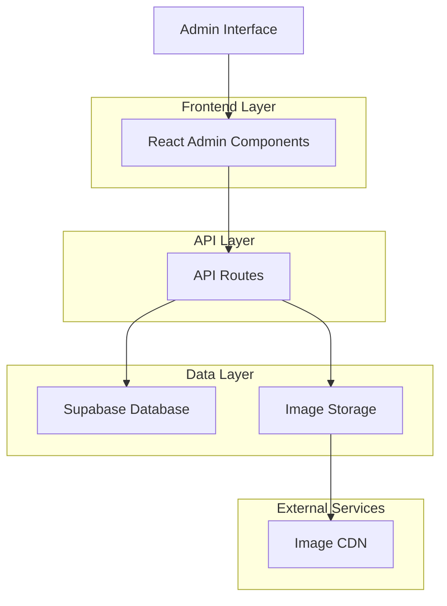
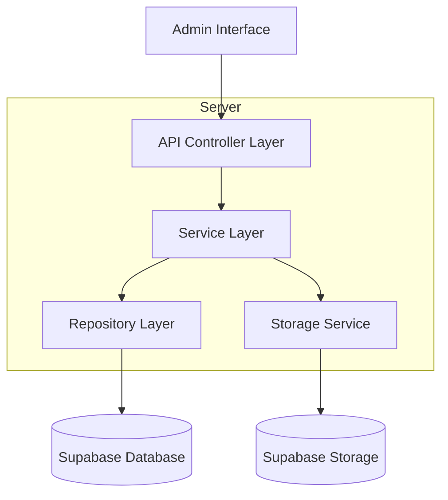
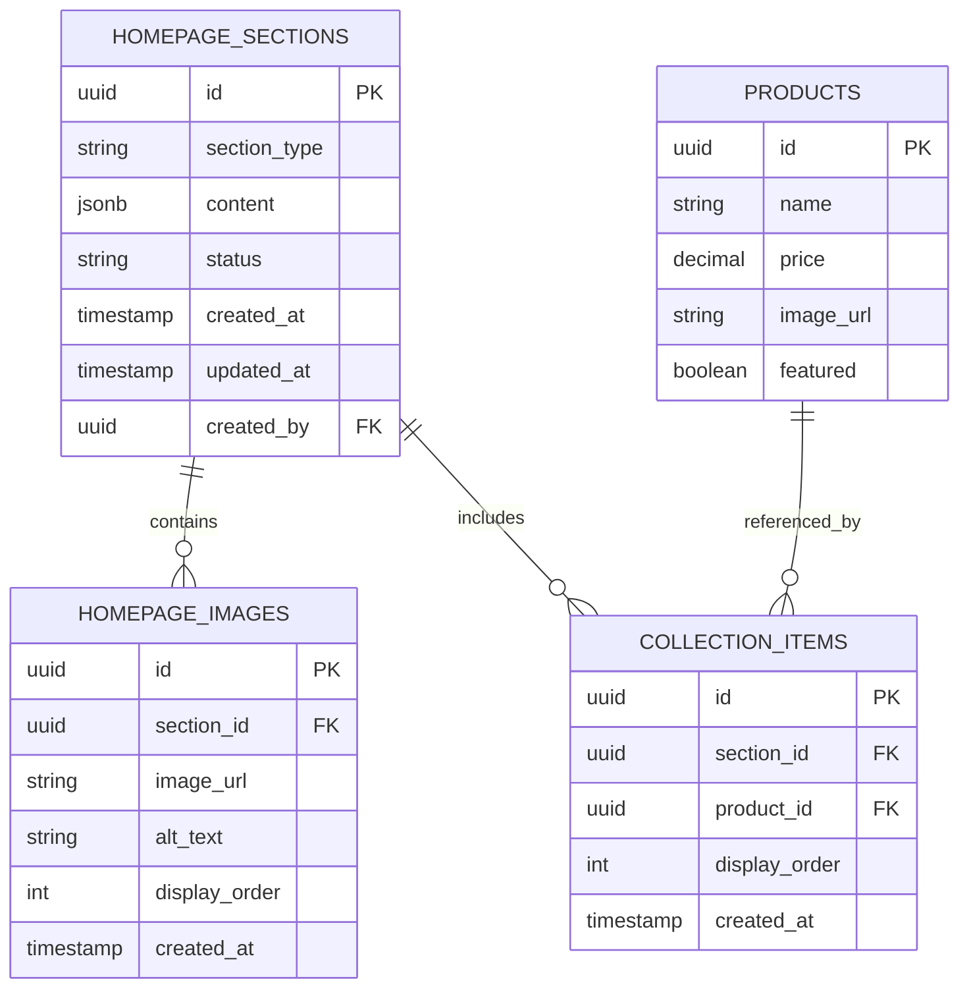

# Homepage Content Management System - Technical Architecture

## 1. Architecture Design



## 2. Technology Description

- Frontend: React@18 + TypeScript + Tailwind CSS + Next.js@14
- Backend: Next.js API Routes + Supabase
- Database: Supabase (PostgreSQL)
- File Storage: Supabase Storage
- Image Processing: Next.js Image Optimization

## 3. Route Definitions

| Route | Purpose |
|-------|---------|
| /admin/homepage | Main homepage management dashboard |
| /admin/homepage/hero | Hero section editor interface |
| /admin/homepage/collections | Collections management interface |
| /admin/homepage/approach | Approach section editor interface |
| /admin/homepage/preview | Live preview and publishing interface |

## 4. API Definitions

### 4.1 Core API

Homepage sections management
```
GET /api/admin/homepage/sections
```

Response:
| Param Name | Param Type | Description |
|------------|------------|-------------|
| sections | object | All homepage sections data |
| hero | object | Hero section configuration |
| collections | array | Featured collections data |
| approach | object | Approach section content |

```
PUT /api/admin/homepage/sections
```

Request:
| Param Name | Param Type | isRequired | Description |
|------------|------------|------------|-------------|
| section_type | string | true | Type of section (hero, collections, approach) |
| content | object | true | Section content data |
| status | string | true | draft or published |

Hero section management
```
POST /api/admin/homepage/hero
```

Request:
| Param Name | Param Type | isRequired | Description |
|------------|------------|------------|-------------|
| title | string | true | Hero section title |
| subtitle | string | true | Hero section subtitle |
| cta_text | string | true | Call-to-action button text |
| hero_images | array | true | Array of hero image URLs |
| navigation_categories | array | true | Navigation category links |

Collections management
```
POST /api/admin/homepage/collections
```

Request:
| Param Name | Param Type | isRequired | Description |
|------------|------------|------------|-------------|
| collection_type | string | true | new_this_week or xiv_collections |
| title | string | true | Collection section title |
| product_ids | array | true | Array of selected product IDs |
| auto_rules | object | false | Automatic selection rules |

Image upload
```
POST /api/admin/homepage/upload
```

Request:
| Param Name | Param Type | isRequired | Description |
|------------|------------|------------|-------------|
| file | File | true | Image file to upload |
| section | string | true | Section type for the image |
| alt_text | string | false | Alternative text for accessibility |

## 5. Server Architecture Diagram



## 6. Data Model

### 6.1 Data Model Definition



### 6.2 Data Definition Language

Homepage Sections Table
```sql
-- Create homepage_sections table
CREATE TABLE homepage_sections (
    id UUID PRIMARY KEY DEFAULT gen_random_uuid(),
    section_type VARCHAR(50) NOT NULL CHECK (section_type IN ('hero', 'new_this_week', 'xiv_collections', 'approach')),
    content JSONB NOT NULL DEFAULT '{}',
    status VARCHAR(20) DEFAULT 'draft' CHECK (status IN ('draft', 'published', 'scheduled')),
    scheduled_publish_at TIMESTAMP WITH TIME ZONE,
    created_at TIMESTAMP WITH TIME ZONE DEFAULT NOW(),
    updated_at TIMESTAMP WITH TIME ZONE DEFAULT NOW(),
    created_by UUID REFERENCES auth.users(id)
);

-- Create homepage_images table
CREATE TABLE homepage_images (
    id UUID PRIMARY KEY DEFAULT gen_random_uuid(),
    section_id UUID REFERENCES homepage_sections(id) ON DELETE CASCADE,
    image_url TEXT NOT NULL,
    alt_text TEXT,
    display_order INTEGER DEFAULT 0,
    created_at TIMESTAMP WITH TIME ZONE DEFAULT NOW()
);

-- Create collection_items table
CREATE TABLE collection_items (
    id UUID PRIMARY KEY DEFAULT gen_random_uuid(),
    section_id UUID REFERENCES homepage_sections(id) ON DELETE CASCADE,
    product_id UUID REFERENCES products(id) ON DELETE CASCADE,
    display_order INTEGER DEFAULT 0,
    created_at TIMESTAMP WITH TIME ZONE DEFAULT NOW()
);

-- Create indexes
CREATE INDEX idx_homepage_sections_type ON homepage_sections(section_type);
CREATE INDEX idx_homepage_sections_status ON homepage_sections(status);
CREATE INDEX idx_homepage_images_section ON homepage_images(section_id);
CREATE INDEX idx_collection_items_section ON collection_items(section_id);
CREATE INDEX idx_collection_items_product ON collection_items(product_id);

-- Row Level Security (RLS)
ALTER TABLE homepage_sections ENABLE ROW LEVEL SECURITY;
ALTER TABLE homepage_images ENABLE ROW LEVEL SECURITY;
ALTER TABLE collection_items ENABLE ROW LEVEL SECURITY;

-- RLS Policies
CREATE POLICY "Public can view published homepage sections" ON homepage_sections
    FOR SELECT USING (status = 'published');

CREATE POLICY "Authenticated users can manage homepage sections" ON homepage_sections
    FOR ALL USING (auth.role() = 'authenticated');

CREATE POLICY "Public can view homepage images" ON homepage_images
    FOR SELECT USING (true);

CREATE POLICY "Authenticated users can manage homepage images" ON homepage_images
    FOR ALL USING (auth.role() = 'authenticated');

CREATE POLICY "Public can view collection items" ON collection_items
    FOR SELECT USING (true);

CREATE POLICY "Authenticated users can manage collection items" ON collection_items
    FOR ALL USING (auth.role() = 'authenticated');

-- Insert initial data
INSERT INTO homepage_sections (section_type, content, status) VALUES
('hero', '{
    "title": "Welcome to Espada",
    "subtitle": "Discover our premium collection",
    "cta_text": "Shop Collections",
    "navigation_categories": [
        {"name": "Sudo", "href": "/sudo"},
        {"name": "XVII", "href": "/xvii"},
        {"name": "Teyo", "href": "/teyo"}
    ]
}', 'published'),
('new_this_week', '{
    "title": "New This Week",
    "count": 50
}', 'published'),
('xiv_collections', '{
    "title": "XIV Collections",
    "count": 50
}', 'published'),
('approach', '{
    "title": "Our Approach",
    "paragraphs": [
        "We believe in creating timeless pieces that transcend seasonal trends. Our approach to fashion is rooted in sustainability, quality craftsmanship, and innovative design. Each piece in our collection is carefully curated to ensure it meets our high standards for both style and durability.",
        "From the initial concept to the final product, we work closely with skilled artisans and use only the finest materials. Our commitment to ethical production practices ensures that every garment is made with respect for both the environment and the people who create them."
    ]
}', 'published');

-- Insert initial hero images
INSERT INTO homepage_images (section_id, image_url, alt_text, display_order)
SELECT 
    (SELECT id FROM homepage_sections WHERE section_type = 'hero'),
    '/images/mg0ujxhg-rt8uqe1.png',
    'Collection item',
    1
UNION ALL
SELECT 
    (SELECT id FROM homepage_sections WHERE section_type = 'hero'),
    '/images/mg0ujxhg-glpb31v.png',
    'Collection item',
    2;

-- Insert initial approach images
INSERT INTO homepage_images (section_id, image_url, alt_text, display_order)
SELECT 
    (SELECT id FROM homepage_sections WHERE section_type = 'approach'),
    '/images/mg0ujxhg-rt8uqe1.png',
    'Sustainable Materials',
    1
UNION ALL
SELECT 
    (SELECT id FROM homepage_sections WHERE section_type = 'approach'),
    '/images/mg0ujxhg-glpb31v.png',
    'Quality Craftsmanship',
    2
UNION ALL
SELECT 
    (SELECT id FROM homepage_sections WHERE section_type = 'approach'),
    '/images/mg0ujxhg-rt8uqe1.png',
    'Innovative Design',
    3;
```