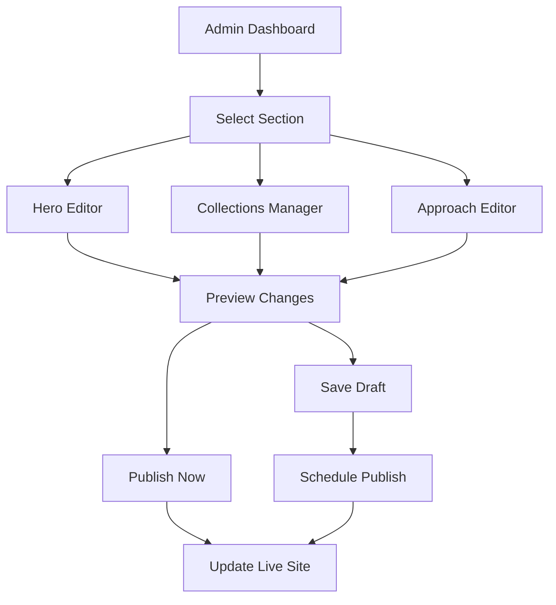

# Homepage Content Management System

## 1. Product Overview

A comprehensive admin interface for managing all dynamic content on the Espada homepage, including hero images, featured collections, product showcases, and approach section content. This system enables real-time content updates without requiring code changes.

The system addresses the need for non-technical content management, allowing administrators to update homepage visuals and collections dynamically, improving marketing agility and content freshness.

## 2. Core Features

### 2.1 User Roles

| Role | Registration Method | Core Permissions |
|------|---------------------|------------------|
| Admin | Admin panel login | Full access to homepage content management |
| Super Admin | System-level access | All admin permissions + system configuration |

### 2.2 Feature Module

Our homepage content management system consists of the following main pages:

1. **Homepage Management Dashboard**: overview of all sections, quick edit access, preview functionality
2. **Hero Section Editor**: manage hero images, navigation categories, title/subtitle content
3. **Collections Manager**: configure featured product collections (New This Week, XIV Collections)
4. **Approach Section Editor**: manage approach images and descriptive text content
5. **Preview & Publish**: real-time preview with publish/draft functionality

### 2.3 Page Details

| Page Name | Module Name | Feature description |
|-----------|-------------|---------------------|
| Homepage Management Dashboard | Section Overview | Display all homepage sections with status indicators, quick edit buttons, and last modified timestamps |
| Homepage Management Dashboard | Preview Panel | Live preview of homepage with current content, toggle between published and draft versions |
| Hero Section Editor | Image Management | Upload and manage 2 hero collection images with drag-and-drop reordering |
| Hero Section Editor | Navigation Categories | Edit category names and links (Sudo, XVII, Teyo) with URL validation |
| Hero Section Editor | Content Editor | Edit hero title, subtitle, and CTA button text with character limits |
| Collections Manager | Product Selection | Select products for featured collections from existing product database |
| Collections Manager | Collection Configuration | Set collection titles, product counts, and display order |
| Collections Manager | Auto-Collection Rules | Define rules for automatic product selection based on criteria (new, featured, category) |
| Approach Section Editor | Image Gallery | Manage 3 approach images with alt text and captions |
| Approach Section Editor | Content Editor | Rich text editor for approach section paragraphs with formatting options |
| Preview & Publish | Live Preview | Real-time preview of homepage with all changes before publishing |
| Preview & Publish | Version Control | Save drafts, schedule publishing, and revert to previous versions |

## 3. Core Process

**Admin Content Management Flow:**
1. Admin logs into the admin panel and navigates to Homepage Management
2. Admin selects a section to edit (Hero, Collections, or Approach)
3. Admin makes changes using the appropriate editor interface
4. Admin previews changes in real-time preview panel
5. Admin saves as draft or publishes changes immediately
6. System updates the live homepage with new content

**Content Publishing Flow:**
1. Admin creates/edits content in draft mode
2. System validates all required fields and image formats
3. Admin reviews changes in preview mode
4. Admin publishes content with optional scheduling
5. System updates database and clears relevant caches
6. Live homepage reflects new content immediately

## 4. User Interface Design

### 4.1 Design Style

- **Primary Colors**: #000000 (black), #FFFFFF (white)
- **Secondary Colors**: #F5F5F5 (light gray), #E5E5E5 (border gray)
- **Button Style**: Rounded corners (8px), subtle shadows, hover animations
- **Font**: Gilroy font family, 14px base size, 16px for headings
- **Layout Style**: Card-based design with clean spacing, left sidebar navigation
- **Icons**: Lucide React icons, 20px standard size, consistent stroke width

### 4.2 Page Design Overview

| Page Name | Module Name | UI Elements |
|-----------|-------------|-------------|
| Homepage Management Dashboard | Section Cards | Clean white cards with section previews, edit buttons, and status indicators |
| Homepage Management Dashboard | Quick Actions | Floating action buttons for common tasks, minimal design with tooltips |
| Hero Section Editor | Image Upload | Drag-and-drop zones with progress indicators, image preview thumbnails |
| Hero Section Editor | Form Fields | Clean input fields with floating labels, validation states |
| Collections Manager | Product Grid | Searchable product grid with selection checkboxes, pagination |
| Collections Manager | Collection Preview | Mini preview cards showing selected products in collection layout |
| Approach Section Editor | Rich Text Editor | Minimal toolbar with essential formatting options, live character count |
| Approach Section Editor | Image Manager | Grid layout for 3 images with overlay edit controls |
| Preview & Publish | Split View | Left panel for editing, right panel for live preview with device toggles |

### 4.3 Responsiveness

Desktop-first design with mobile-adaptive layouts. Touch-optimized controls for tablet use, with collapsible sidebar navigation on smaller screens.