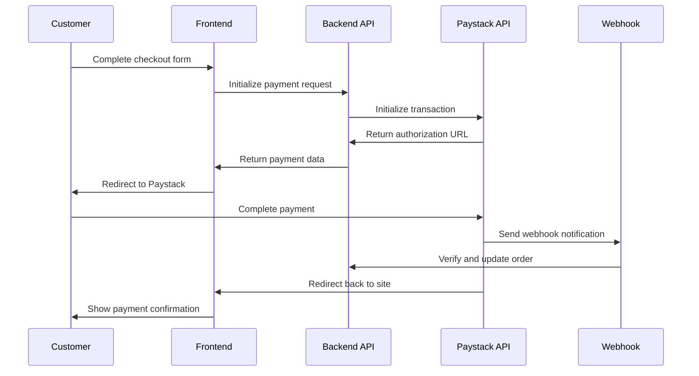

# Paystack Payment Integration - Technical Implementation Guide

## 1. Current System Analysis

### 1.1 Existing Architecture Overview
Your Espada e-commerce project currently has:
- **Frontend**: Next.js 15 with TypeScript and React 18
- **Backend**: Supabase with PostgreSQL database
- **Authentication**: Supabase Auth with customer profiles
- **Order Management**: Complete order system with order_items tracking
- **Payment Method**: Currently limited to 'cash_on_delivery'

### 1.2 Database Schema Analysis
```sql
-- Current orders table structure
CREATE TABLE orders (
  id UUID DEFAULT gen_random_uuid() PRIMARY KEY,
  customer_id UUID REFERENCES customer_profiles(id) ON DELETE CASCADE,
  order_number VARCHAR(50) UNIQUE NOT NULL,
  status VARCHAR(50) DEFAULT 'pending',
  total_amount DECIMAL(10,2) NOT NULL,
  currency VARCHAR(3) DEFAULT 'USD',
  shipping_address JSONB,
  billing_address JSONB,
  payment_status VARCHAR(50) DEFAULT 'pending',  -- Ready for Paystack
  payment_method VARCHAR(50),                    -- Ready for Paystack
  notes TEXT,
  created_at TIMESTAMP WITH TIME ZONE DEFAULT NOW(),
  updated_at TIMESTAMP WITH TIME ZONE DEFAULT NOW()
);
```

### 1.3 Current Checkout Flow
1. Customer fills shipping information
2. Order is created with `payment_method: 'cash_on_delivery'`
3. Order status set to 'pending'
4. Payment status set to 'pending'
5. Customer redirected to order confirmation

## 2. Paystack Integration Requirements

### 2.1 Payment Flow Design


### 2.2 Required Database Modifications

#### 2.2.1 New Payment Transactions Table
```sql
-- Create payments table for tracking Paystack transactions
CREATE TABLE payments (
  id UUID DEFAULT gen_random_uuid() PRIMARY KEY,
  order_id UUID REFERENCES orders(id) ON DELETE CASCADE,
  paystack_reference VARCHAR(255) UNIQUE NOT NULL,
  paystack_access_code VARCHAR(255),
  authorization_url TEXT,
  amount DECIMAL(10,2) NOT NULL,
  currency VARCHAR(3) DEFAULT 'NGN',
  status VARCHAR(50) DEFAULT 'pending', -- pending, success, failed, abandoned
  gateway_response TEXT,
  paid_at TIMESTAMP WITH TIME ZONE,
  created_at TIMESTAMP WITH TIME ZONE DEFAULT NOW(),
  updated_at TIMESTAMP WITH TIME ZONE DEFAULT NOW()
);

-- Add indexes for performance
CREATE INDEX idx_payments_order_id ON payments(order_id);
CREATE INDEX idx_payments_reference ON payments(paystack_reference);
CREATE INDEX idx_payments_status ON payments(status);

-- Add RLS policies
ALTER TABLE payments ENABLE ROW LEVEL SECURITY;

-- Customers can read their own payments
CREATE POLICY "Customers can read their own payments" ON payments
  FOR SELECT USING (
    order_id IN (
      SELECT o.id FROM orders o
      JOIN customer_profiles cp ON o.customer_id = cp.id
      WHERE cp.stack_user_id = current_setting('request.jwt.claims', true)::json->>'sub'
    )
  );

-- Admins can manage all payments
CREATE POLICY "Admins can manage all payments" ON payments
  FOR ALL USING (
    EXISTS (
      SELECT 1 FROM admins 
      WHERE email = current_setting('request.jwt.claims', true)::json->>'email'
    )
  );

GRANT ALL PRIVILEGES ON payments TO authenticated;
```

#### 2.2.2 Update Orders Table
```sql
-- Add Paystack-specific fields to orders table
ALTER TABLE orders ADD COLUMN IF NOT EXISTS paystack_reference VARCHAR(255);
ALTER TABLE orders ADD COLUMN IF NOT EXISTS payment_gateway VARCHAR(50) DEFAULT 'paystack';

-- Add index for Paystack reference
CREATE INDEX IF NOT EXISTS idx_orders_paystack_reference ON orders(paystack_reference);
```

### 2.3 Environment Variables Required
```env
# Paystack Configuration
PAYSTACK_PUBLIC_KEY=pk_test_your_public_key_here
PAYSTACK_SECRET_KEY=sk_test_your_secret_key_here
PAYSTACK_WEBHOOK_SECRET=your_webhook_secret_here

# Application URLs
NEXT_PUBLIC_APP_URL=http://localhost:3000
PAYSTACK_CALLBACK_URL=http://localhost:3000/payment/callback
```

## 3. Technical Implementation Plan

### 3.1 Required Dependencies
```json
{
  "dependencies": {
    "paystack-js": "^2.0.0"
  }
}
```

### 3.2 Backend API Implementation

#### 3.2.1 Paystack Service Layer
```typescript
// lib/paystack.ts
interface PaystackConfig {
  secretKey: string;
  publicKey: string;
  baseUrl: string;
}

interface InitializeTransactionRequest {
  email: string;
  amount: number; // in kobo (NGN) or cents (USD)
  reference: string;
  callback_url: string;
  metadata?: {
    order_id: string;
    customer_id: string;
    [key: string]: any;
  };
}

interface InitializeTransactionResponse {
  status: boolean;
  message: string;
  data: {
    authorization_url: string;
    access_code: string;
    reference: string;
  };
}

interface VerifyTransactionResponse {
  status: boolean;
  message: string;
  data: {
    id: number;
    domain: string;
    status: string;
    reference: string;
    amount: number;
    message: string;
    gateway_response: string;
    paid_at: string;
    created_at: string;
    channel: string;
    currency: string;
    authorization: {
      authorization_code: string;
      bin: string;
      last4: string;
      exp_month: string;
      exp_year: string;
      channel: string;
      card_type: string;
      bank: string;
      country_code: string;
      brand: string;
    };
    customer: {
      id: number;
      first_name: string;
      last_name: string;
      email: string;
      customer_code: string;
      phone: string;
    };
  };
}

class PaystackService {
  private config: PaystackConfig;

  constructor() {
    this.config = {
      secretKey: process.env.PAYSTACK_SECRET_KEY!,
      publicKey: process.env.PAYSTACK_PUBLIC_KEY!,
      baseUrl: 'https://api.paystack.co'
    };
  }

  async initializeTransaction(data: InitializeTransactionRequest): Promise<InitializeTransactionResponse> {
    const response = await fetch(`${this.config.baseUrl}/transaction/initialize`, {
      method: 'POST',
      headers: {
        'Authorization': `Bearer ${this.config.secretKey}`,
        'Content-Type': 'application/json',
      },
      body: JSON.stringify(data),
    });

    if (!response.ok) {
      throw new Error(`Paystack API error: ${response.statusText}`);
    }

    return response.json();
  }

  async verifyTransaction(reference: string): Promise<VerifyTransactionResponse> {
    const response = await fetch(`${this.config.baseUrl}/transaction/verify/${reference}`, {
      method: 'GET',
      headers: {
        'Authorization': `Bearer ${this.config.secretKey}`,
        'Content-Type': 'application/json',
      },
    });

    if (!response.ok) {
      throw new Error(`Paystack verification error: ${response.statusText}`);
    }

    return response.json();
  }

  generateReference(): string {
    const timestamp = Date.now();
    const random = Math.floor(Math.random() * 1000000);
    return `ESP_${timestamp}_${random}`;
  }

  convertToKobo(amount: number): number {
    // Convert from dollars to kobo (NGN smallest unit)
    // 1 USD = 100 cents, 1 NGN = 100 kobo
    return Math.round(amount * 100);
  }
}

export const paystackService = new PaystackService();
```

#### 3.2.2 Payment Initialization API
```typescript
// app/api/payments/initialize/route.ts
import { NextRequest, NextResponse } from 'next/server';
import { supabaseAdmin } from '@/lib/supabase-admin';
import { paystackService } from '@/lib/paystack';

interface InitializePaymentRequest {
  order_id: string;
  customer_email: string;
  amount: number;
  currency: string;
}

export async function POST(request: NextRequest) {
  try {
    const body: InitializePaymentRequest = await request.json();
    
    // Validate request
    if (!body.order_id || !body.customer_email || !body.amount) {
      return NextResponse.json({
        success: false,
        error: 'Missing required fields: order_id, customer_email, amount'
      }, { status: 400 });
    }

    // Verify order exists and belongs to customer
    const { data: order, error: orderError } = await supabaseAdmin
      .from('orders')
      .select(`
        id,
        customer_id,
        order_number,
        total_amount,
        payment_status,
        customer_profiles!inner(email)
      `)
      .eq('id', body.order_id)
      .single();

    if (orderError || !order) {
      return NextResponse.json({
        success: false,
        error: 'Order not found'
      }, { status: 404 });
    }

    if (order.payment_status === 'completed') {
      return NextResponse.json({
        success: false,
        error: 'Order already paid'
      }, { status: 400 });
    }

    // Generate unique reference
    const reference = paystackService.generateReference();
    
    // Convert amount to kobo
    const amountInKobo = paystackService.convertToKobo(body.amount);

    // Initialize Paystack transaction
    const paystackResponse = await paystackService.initializeTransaction({
      email: body.customer_email,
      amount: amountInKobo,
      reference: reference,
      callback_url: `${process.env.NEXT_PUBLIC_APP_URL}/payment/callback`,
      metadata: {
        order_id: body.order_id,
        customer_id: order.customer_id,
        order_number: order.order_number
      }
    });

    if (!paystackResponse.status) {
      return NextResponse.json({
        success: false,
        error: 'Failed to initialize payment'
      }, { status: 500 });
    }

    // Save payment record
    const { error: paymentError } = await supabaseAdmin
      .from('payments')
      .insert({
        order_id: body.order_id,
        paystack_reference: reference,
        paystack_access_code: paystackResponse.data.access_code,
        authorization_url: paystackResponse.data.authorization_url,
        amount: body.amount,
        currency: body.currency,
        status: 'pending'
      });

    if (paymentError) {
      console.error('Error saving payment record:', paymentError);
      return NextResponse.json({
        success: false,
        error: 'Failed to save payment record'
      }, { status: 500 });
    }

    // Update order with Paystack reference
    await supabaseAdmin
      .from('orders')
      .update({
        paystack_reference: reference,
        payment_method: 'paystack',
        payment_gateway: 'paystack'
      })
      .eq('id', body.order_id);

    return NextResponse.json({
      success: true,
      data: {
        authorization_url: paystackResponse.data.authorization_url,
        access_code: paystackResponse.data.access_code,
        reference: reference
      }
    });

  } catch (error) {
    console.error('Error initializing payment:', error);
    return NextResponse.json({
      success: false,
      error: 'Internal server error'
    }, { status: 500 });
  }
}
```

#### 3.2.3 Payment Verification API
```typescript
// app/api/payments/verify/route.ts
import { NextRequest, NextResponse } from 'next/server';
import { supabaseAdmin } from '@/lib/supabase-admin';
import { paystackService } from '@/lib/paystack';

export async function POST(request: NextRequest) {
  try {
    const { reference } = await request.json();
    
    if (!reference) {
      return NextResponse.json({
        success: false,
        error: 'Payment reference is required'
      }, { status: 400 });
    }

    // Verify transaction with Paystack
    const verification = await paystackService.verifyTransaction(reference);
    
    if (!verification.status) {
      return NextResponse.json({
        success: false,
        error: 'Payment verification failed'
      }, { status: 400 });
    }

    const { data: transactionData } = verification;

    // Get payment record
    const { data: payment, error: paymentError } = await supabaseAdmin
      .from('payments')
      .select('*')
      .eq('paystack_reference', reference)
      .single();

    if (paymentError || !payment) {
      return NextResponse.json({
        success: false,
        error: 'Payment record not found'
      }, { status: 404 });
    }

    // Update payment status
    const paymentStatus = transactionData.status === 'success' ? 'success' : 'failed';
    
    await supabaseAdmin
      .from('payments')
      .update({
        status: paymentStatus,
        gateway_response: transactionData.gateway_response,
        paid_at: transactionData.status === 'success' ? new Date().toISOString() : null,
        updated_at: new Date().toISOString()
      })
      .eq('paystack_reference', reference);

    // Update order status if payment successful
    if (transactionData.status === 'success') {
      await supabaseAdmin
        .from('orders')
        .update({
          payment_status: 'completed',
          status: 'processing',
          updated_at: new Date().toISOString()
        })
        .eq('id', payment.order_id);
    }

    return NextResponse.json({
      success: true,
      data: {
        status: paymentStatus,
        transaction: transactionData
      }
    });

  } catch (error) {
    console.error('Error verifying payment:', error);
    return NextResponse.json({
      success: false,
      error: 'Internal server error'
    }, { status: 500 });
  }
}
```

#### 3.2.4 Webhook Handler
```typescript
// app/api/webhooks/paystack/route.ts
import { NextRequest, NextResponse } from 'next/server';
import { supabaseAdmin } from '@/lib/supabase-admin';
import crypto from 'crypto';

export async function POST(request: NextRequest) {
  try {
    const body = await request.text();
    const signature = request.headers.get('x-paystack-signature');
    
    if (!signature) {
      return NextResponse.json({ error: 'No signature provided' }, { status: 400 });
    }

    // Verify webhook signature
    const hash = crypto
      .createHmac('sha512', process.env.PAYSTACK_WEBHOOK_SECRET!)
      .update(body)
      .digest('hex');

    if (hash !== signature) {
      return NextResponse.json({ error: 'Invalid signature' }, { status: 400 });
    }

    const event = JSON.parse(body);

    // Handle charge.success event
    if (event.event === 'charge.success') {
      const { reference, status, gateway_response, paid_at } = event.data;

      // Update payment record
      const { data: payment } = await supabaseAdmin
        .from('payments')
        .select('order_id')
        .eq('paystack_reference', reference)
        .single();

      if (payment) {
        // Update payment status
        await supabaseAdmin
          .from('payments')
          .update({
            status: 'success',
            gateway_response,
            paid_at: new Date(paid_at).toISOString(),
            updated_at: new Date().toISOString()
          })
          .eq('paystack_reference', reference);

        // Update order status
        await supabaseAdmin
          .from('orders')
          .update({
            payment_status: 'completed',
            status: 'processing',
            updated_at: new Date().toISOString()
          })
          .eq('id', payment.order_id);
      }
    }

    return NextResponse.json({ received: true });

  } catch (error) {
    console.error('Webhook error:', error);
    return NextResponse.json({ error: 'Webhook processing failed' }, { status: 500 });
  }
}
```

### 3.3 Frontend Implementation

#### 3.3.1 Payment Component
```typescript
// components/checkout/PaymentMethods.tsx
'use client';

import React, { useState } from 'react';
import { Button } from '@/components/ui/Button';
import { useToastActions } from '@/hooks/useToast';

interface PaymentMethodsProps {
  orderId: string;
  customerEmail: string;
  totalAmount: number;
  currency: string;
  onPaymentSuccess: (reference: string) => void;
  onPaymentError: (error: string) => void;
}

export default function PaymentMethods({
  orderId,
  customerEmail,
  totalAmount,
  currency,
  onPaymentSuccess,
  onPaymentError
}: PaymentMethodsProps) {
  const [selectedMethod, setSelectedMethod] = useState<'paystack' | 'cod'>('paystack');
  const [isProcessing, setIsProcessing] = useState(false);
  const { success, error } = useToastActions();

  const handlePaystackPayment = async () => {
    setIsProcessing(true);

    try {
      // Initialize payment
      const response = await fetch('/api/payments/initialize', {
        method: 'POST',
        headers: {
          'Content-Type': 'application/json',
        },
        body: JSON.stringify({
          order_id: orderId,
          customer_email: customerEmail,
          amount: totalAmount,
          currency: currency
        }),
      });

      const result = await response.json();

      if (!result.success) {
        throw new Error(result.error);
      }

      // Redirect to Paystack
      window.location.href = result.data.authorization_url;

    } catch (err) {
      console.error('Payment initialization error:', err);
      error('Payment Error', err instanceof Error ? err.message : 'Failed to initialize payment');
      onPaymentError(err instanceof Error ? err.message : 'Payment failed');
    } finally {
      setIsProcessing(false);
    }
  };

  const handleCashOnDelivery = () => {
    // Handle COD logic (existing implementation)
    onPaymentSuccess('cod_payment');
  };

  return (
    <div className="space-y-6">
      <h3 className="text-lg font-semibold text-label-primary">Payment Method</h3>
      
      <div className="space-y-4">
        {/* Paystack Payment */}
        <div className="border border-separator rounded-lg p-4">
          <label className="flex items-center space-x-3">
            <input
              type="radio"
              name="payment_method"
              value="paystack"
              checked={selectedMethod === 'paystack'}
              onChange={(e) => setSelectedMethod(e.target.value as 'paystack')}
              className="w-4 h-4 text-blue-600"
            />
            <div className="flex-1">
              <div className="font-medium text-label-primary">Card Payment</div>
              <div className="text-sm text-label-secondary">
                Pay securely with your debit/credit card via Paystack
              </div>
            </div>
            <div className="flex items-center space-x-2">
              
              
              
            </div>
          </label>
        </div>

        {/* Cash on Delivery */}
        <div className="border border-separator rounded-lg p-4">
          <label className="flex items-center space-x-3">
            <input
              type="radio"
              name="payment_method"
              value="cod"
              checked={selectedMethod === 'cod'}
              onChange={(e) => setSelectedMethod(e.target.value as 'cod')}
              className="w-4 h-4 text-blue-600"
            />
            <div className="flex-1">
              <div className="font-medium text-label-primary">Cash on Delivery</div>
              <div className="text-sm text-label-secondary">
                Pay when your order is delivered
              </div>
            </div>
          </label>
        </div>
      </div>

      <Button
        onClick={selectedMethod === 'paystack' ? handlePaystackPayment : handleCashOnDelivery}
        disabled={isProcessing}
        className="w-full"
      >
        {isProcessing ? 'Processing...' : 
         selectedMethod === 'paystack' ? `Pay $${totalAmount.toFixed(2)}` : 'Place Order'}
      </Button>
    </div>
  );
}
```

#### 3.3.2 Payment Callback Page
```typescript
// app/payment/callback/page.tsx
'use client';

import React, { useEffect, useState } from 'react';
import { useRouter, useSearchParams } from 'next/navigation';
import { Loader2, CheckCircle, XCircle } from 'lucide-react';
import Header from '@/components/layout/Header';
import Footer from '@/components/layout/Footer';
import { Button } from '@/components/ui/Button';

export default function PaymentCallback() {
  const router = useRouter();
  const searchParams = useSearchParams();
  const [status, setStatus] = useState<'loading' | 'success' | 'failed'>('loading');
  const [message, setMessage] = useState('');
  const [orderNumber, setOrderNumber] = useState('');

  useEffect(() => {
    const reference = searchParams.get('reference');
    
    if (!reference) {
      setStatus('failed');
      setMessage('Invalid payment reference');
      return;
    }

    verifyPayment(reference);
  }, [searchParams]);

  const verifyPayment = async (reference: string) => {
    try {
      const response = await fetch('/api/payments/verify', {
        method: 'POST',
        headers: {
          'Content-Type': 'application/json',
        },
        body: JSON.stringify({ reference }),
      });

      const result = await response.json();

      if (result.success && result.data.status === 'success') {
        setStatus('success');
        setMessage('Payment completed successfully!');
        setOrderNumber(result.data.transaction.metadata?.order_number || '');
      } else {
        setStatus('failed');
        setMessage('Payment verification failed');
      }
    } catch (error) {
      console.error('Payment verification error:', error);
      setStatus('failed');
      setMessage('Failed to verify payment');
    }
  };

  return (
    <div className="min-h-screen bg-background">
      <Header />
      
      <div className="max-w-md mx-auto px-4 py-16">
        <div className="text-center">
          {status === 'loading' && (
            <>
              <Loader2 className="w-16 h-16 animate-spin text-blue-600 mx-auto mb-4" />
              <h1 className="text-2xl font-bold text-label-primary mb-2">
                Verifying Payment
              </h1>
              <p className="text-label-secondary">
                Please wait while we confirm your payment...
              </p>
            </>
          )}

          {status === 'success' && (
            <>
              <CheckCircle className="w-16 h-16 text-green-600 mx-auto mb-4" />
              <h1 className="text-2xl font-bold text-label-primary mb-2">
                Payment Successful!
              </h1>
              <p className="text-label-secondary mb-6">
                {message}
                {orderNumber && (
                  <span className="block mt-2 font-medium">
                    Order #{orderNumber}
                  </span>
                )}
              </p>
              <div className="space-y-3">
                <Button
                  onClick={() => router.push('/account/orders')}
                  className="w-full"
                >
                  View Orders
                </Button>
                <Button
                  onClick={() => router.push('/products')}
                  variant="outline"
                  className="w-full"
                >
                  Continue Shopping
                </Button>
              </div>
            </>
          )}

          {status === 'failed' && (
            <>
              <XCircle className="w-16 h-16 text-red-600 mx-auto mb-4" />
              <h1 className="text-2xl font-bold text-label-primary mb-2">
                Payment Failed
              </h1>
              <p className="text-label-secondary mb-6">
                {message}
              </p>
              <div className="space-y-3">
                <Button
                  onClick={() => router.push('/checkout')}
                  className="w-full"
                >
                  Try Again
                </Button>
                <Button
                  onClick={() => router.push('/products')}
                  variant="outline"
                  className="w-full"
                >
                  Continue Shopping
                </Button>
              </div>
            </>
          )}
        </div>
      </div>

      <Footer />
    </div>
  );
}
```

### 3.4 Updated Checkout Integration

#### 3.4.1 Modified Checkout Page
```typescript
// Update to app/checkout/page.tsx (payment section)
// Replace the existing handlePlaceOrder function with:

const handlePlaceOrder = async () => {
  if (!user || !profile) {
    showError('Authentication required', 'Please sign in to place an order')
    return
  }

  // Validate required fields
  const newErrors: Record<string, string> = {}
  
  if (!contactInfo.email) newErrors.email = 'Email is required'
  if (!shippingAddress.firstName) newErrors.firstName = 'First name is required'
  if (!shippingAddress.lastName) newErrors.lastName = 'Last name is required'
  if (!shippingAddress.address) newErrors.address = 'Address is required'
  if (!shippingAddress.city) newErrors.city = 'City is required'
  if (!shippingAddress.postalCode) newErrors.postalCode = 'Postal code is required'

  if (Object.keys(newErrors).length > 0) {
    setErrors(newErrors)
    showError('Missing information', 'Please fill in all required fields')
    setCurrentStep('information')
    return
  }

  setIsPlacingOrder(true)

  try {
    // Prepare order data
    const orderData = {
      customer_id: profile.id,
      items: state.items.map(item => ({
        product_id: String(item.id),
        quantity: item.quantity,
        unit_price: item.price,
        color: item.color,
        size: item.size
      })),
      total_amount: state.total,
      shipping_address: {
        street: shippingAddress.address,
        city: shippingAddress.city,
        state: shippingAddress.state,
        postal_code: shippingAddress.postalCode,
        country: shippingAddress.country
      },
      billing_address: {
        street: shippingAddress.address,
        city: shippingAddress.city,
        state: shippingAddress.state,
        postal_code: shippingAddress.postalCode,
        country: shippingAddress.country
      },
      payment_method: selectedPaymentMethod, // Add this state
      notes: `Contact: ${contactInfo.phone || 'Not provided'}`
    }

    // Create order first
    const response = await fetch('/api/orders', {
      method: 'POST',
      headers: {
        'Content-Type': 'application/json',
      },
      body: JSON.stringify(orderData),
    })

    const result = await response.json()

    if (!response.ok || !result.success) {
      throw new Error(result.error || 'Failed to create order')
    }

    // Handle payment based on selected method
    if (selectedPaymentMethod === 'paystack') {
      // Initialize Paystack payment
      const paymentResponse = await fetch('/api/payments/initialize', {
        method: 'POST',
        headers: {
          'Content-Type': 'application/json',
        },
        body: JSON.stringify({
          order_id: result.data.order_id,
          customer_email: contactInfo.email,
          amount: state.total,
          currency: 'USD'
        }),
      })

      const paymentResult = await paymentResponse.json()

      if (!paymentResult.success) {
        throw new Error(paymentResult.error || 'Failed to initialize payment')
      }

      // Clear cart before redirecting
      clearCart()
      
      // Redirect to Paystack
      window.location.href = paymentResult.data.authorization_url
    } else {
      // Cash on delivery - existing flow
      clearCart()
      success('Order placed successfully!', `Order #${result.data.order_number} has been created`)
      router.push(`/account/orders?new_order=${result.data.order_number}`)
    }

  } catch (err) {
    console.error('Error placing order:', err)
    showError(
      'Order failed', 
      err instanceof Error ? err.message : 'Please try again or contact support'
    )
  } finally {
    setIsPlacingOrder(false)
  }
}
```

## 4. Security and Best Practices

### 4.1 API Key Management
- Store Paystack keys in environment variables
- Use test keys for development, live keys for production
- Never expose secret keys in frontend code
- Rotate keys periodically

### 4.2 Payment Verification
- Always verify payments on the server side
- Use webhook notifications for real-time updates
- Implement idempotency to handle duplicate requests
- Log all payment transactions for audit trails

### 4.3 Webhook Security
- Verify webhook signatures using HMAC
- Use HTTPS endpoints for webhooks
- Implement rate limiting on webhook endpoints
- Handle webhook retries gracefully

### 4.4 Error Handling
- Provide clear error messages to users
- Log detailed errors for debugging
- Implement fallback mechanisms
- Handle network timeouts and failures

### 4.5 User Experience
- Show loading states during payment processing
- Provide clear payment status feedback
- Handle payment cancellations gracefully
- Implement payment retry mechanisms

## 5. Testing Strategy

### 5.1 Test Cards (Paystack Test Environment)
```
Successful Payment:
Card Number: 4084084084084081
CVV: 408
Expiry: Any future date

Failed Payment:
Card Number: 4084084084084081
CVV: 081
Expiry: Any future date
```

### 5.2 Testing Checklist
- [ ] Payment initialization
- [ ] Successful payment flow
- [ ] Failed payment handling
- [ ] Webhook processing
- [ ] Order status updates
- [ ] Payment verification
- [ ] Error scenarios
- [ ] Mobile responsiveness
- [ ] Security validations

## 6. Deployment Considerations

### 6.1 Environment Setup
1. Set up Paystack account and get API keys
2. Configure webhook URL in Paystack dashboard
3. Set environment variables in production
4. Run database migrations
5. Test payment flow in staging environment

### 6.2 Monitoring
- Monitor payment success rates
- Track failed payments and reasons
- Set up alerts for webhook failures
- Monitor API response times
- Track conversion rates

This comprehensive guide provides everything needed to integrate Paystack payment gateway into your Espada e-commerce project while maintaining security, reliability, and excellent user experience.