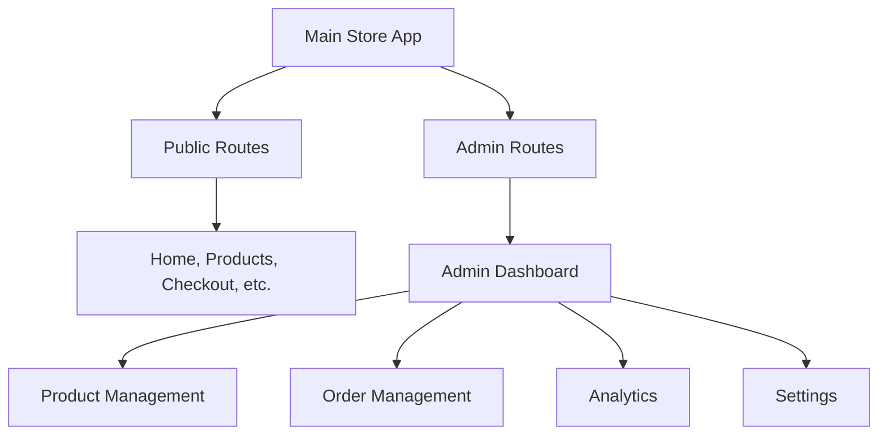

# Admin Dashboard Implementation Plan for Espada Store

## 1. Architecture Overview

### Current Tech Stack Analysis
- **Frontend**: Next.js 15.1.0 with React 18.3.1 and TypeScript
- **Styling**: Tailwind CSS with custom Gilroy font
- **State Management**: Zustand for global state, React Context for cart/locale/toast
- **UI Components**: Custom component library with reusable UI elements
- **Routing**: Next.js App Router (app directory structure)
- **No Database**: Currently using static data and local state
- **No Authentication**: No login system implemented

### Admin Dashboard Architecture
The admin dashboard will be implemented as a separate section within the existing Next.js application, leveraging the current component architecture while maintaining complete separation from the user-facing store.



## 2. Access Strategy (Without Database/Authentication)

### Option 1: Environment-Based Access (Recommended)
- Use environment variables to control admin access
- Create a simple password protection mechanism
- Store admin credentials in `.env.local`
- Implement client-side route protection

### Option 2: Simple Password Protection
- Create a login page with hardcoded credentials
- Use session storage to maintain admin session
- Implement middleware for route protection

### Implementation Details
```typescript
// Environment variables approach
ADMIN_PASSWORD=your_secure_password
ADMIN_USERNAME=admin
NODE_ENV=development // Enable admin in development only
```

## 3. Dashboard Features

### 3.1 Core Admin Functionalities

| Feature | Description | Priority |
|---------|-------------|----------|
| **Product Management** | Add, edit, delete products; manage inventory | High |
| **Order Management** | View orders, update status, manage fulfillment | High |
| **Analytics Dashboard** | Sales metrics, popular products, revenue tracking | Medium |
| **Content Management** | Edit homepage content, manage collections | Medium |
| **Settings** | Store configuration, shipping rates, tax settings | Low |
| **Customer Management** | View customer data, order history | Low |

### 3.2 Detailed Feature Breakdown

#### Product Management
- Product CRUD operations
- Image upload and management
- Inventory tracking
- Category and collection management
- Bulk operations (import/export)

#### Order Management
- Order listing with filters
- Order details view
- Status updates (pending, processing, shipped, delivered)
- Customer communication
- Shipping label generation

#### Analytics
- Revenue dashboard
- Product performance metrics
- Customer analytics
- Sales trends and reports

## 4. File Structure

```
app/
├── admin/                    # Admin dashboard routes
│   ├── layout.tsx           # Admin-specific layout
│   ├── page.tsx             # Admin dashboard home
│   ├── login/
│   │   └── page.tsx         # Admin login page
│   ├── products/
│   │   ├── page.tsx         # Product list
│   │   ├── new/
│   │   │   └── page.tsx     # Add new product
│   │   └── [id]/
│   │       ├── page.tsx     # Product details
│   │       └── edit/
│   │           └── page.tsx # Edit product
│   ├── orders/
│   │   ├── page.tsx         # Order list
│   │   └── [id]/
│   │       └── page.tsx     # Order details
│   ├── analytics/
│   │   └── page.tsx         # Analytics dashboard
│   └── settings/
│       └── page.tsx         # Store settings
│
components/
├── admin/                   # Admin-specific components
│   ├── layout/
│   │   ├── AdminHeader.tsx
│   │   ├── AdminSidebar.tsx
│   │   └── AdminLayout.tsx
│   ├── products/
│   │   ├── ProductForm.tsx
│   │   ├── ProductList.tsx
│   │   └── ProductCard.tsx
│   ├── orders/
│   │   ├── OrderList.tsx
│   │   ├── OrderCard.tsx
│   │   └── OrderStatusBadge.tsx
│   ├── analytics/
│   │   ├── MetricCard.tsx
│   │   ├── SalesChart.tsx
│   │   └── RevenueChart.tsx
│   └── ui/
│       ├── DataTable.tsx
│       ├── AdminButton.tsx
│       └── StatusBadge.tsx
│
lib/
├── admin/
│   ├── auth.ts              # Admin authentication logic
│   ├── data.ts              # Data management functions
│   └── utils.ts             # Admin utility functions
│
data/                        # JSON data files (temporary)
├── products.json
├── orders.json
├── customers.json
└── settings.json
```

## 5. Routing Strategy

### Admin Route Protection
- All admin routes will be under `/admin/*`
- Implement middleware to check admin authentication
- Redirect unauthorized users to login page
- Hide admin routes from main navigation

### Route Structure
```
/admin                    # Admin dashboard home
/admin/login             # Admin login
/admin/products          # Product management
/admin/products/new      # Add new product
/admin/products/[id]     # Product details
/admin/products/[id]/edit # Edit product
/admin/orders            # Order management
/admin/orders/[id]       # Order details
/admin/analytics         # Analytics dashboard
/admin/settings          # Store settings
```

## 6. Data Management (Without Database)

### Temporary Solution: JSON Files
- Store data in JSON files within a `data/` directory
- Use file system operations for CRUD operations
- Implement data validation and error handling
- Create backup mechanisms

### Data Structure Examples
```typescript
// products.json
{
  "products": [
    {
      "id": "1",
      "name": "Product Name",
      "price": 99.99,
      "description": "Product description",
      "images": ["/images/product1.jpg"],
      "category": "clothing",
      "inventory": 50,
      "createdAt": "2024-01-01T00:00:00Z",
      "updatedAt": "2024-01-01T00:00:00Z"
    }
  ]
}

// orders.json
{
  "orders": [
    {
      "id": "order_1",
      "customerEmail": "customer@example.com",
      "items": [{"productId": "1", "quantity": 2, "price": 99.99}],
      "total": 199.98,
      "status": "pending",
      "createdAt": "2024-01-01T00:00:00Z"
    }
  ]
}
```

### Data Management Functions
```typescript
// lib/admin/data.ts
export const getProducts = () => { /* Read from JSON */ }
export const createProduct = (product) => { /* Write to JSON */ }
export const updateProduct = (id, updates) => { /* Update JSON */ }
export const deleteProduct = (id) => { /* Remove from JSON */ }
```

## 7. Security Considerations

### Basic Security Measures
1. **Environment Variables**: Store sensitive data in environment variables
2. **Route Protection**: Implement middleware to protect admin routes
3. **Input Validation**: Validate all form inputs and API requests
4. **HTTPS Only**: Ensure admin access only over HTTPS in production
5. **Session Management**: Implement secure session handling
6. **File Upload Security**: Validate and sanitize file uploads

### Implementation
```typescript
// middleware.ts
export function middleware(request: NextRequest) {
  if (request.nextUrl.pathname.startsWith('/admin')) {
    // Check admin authentication
    const isAuthenticated = checkAdminAuth(request)
    if (!isAuthenticated) {
      return NextResponse.redirect(new URL('/admin/login', request.url))
    }
  }
}
```

## 8. Future Scalability

### Database Migration Path
When ready to implement a proper database:

1. **Choose Database**: Supabase, PostgreSQL, or MongoDB
2. **Data Migration**: Convert JSON data to database tables
3. **API Layer**: Create proper API endpoints
4. **Authentication**: Implement proper user authentication
5. **Permissions**: Add role-based access control

### Authentication Upgrade Path
1. **NextAuth.js**: Implement proper authentication
2. **Role-Based Access**: Admin, Manager, Staff roles
3. **Session Management**: Secure session handling
4. **Multi-Factor Authentication**: Enhanced security

### Performance Optimization
1. **Caching**: Implement Redis or similar caching
2. **Image Optimization**: CDN integration
3. **Database Indexing**: Optimize database queries
4. **API Rate Limiting**: Prevent abuse

## 9. Implementation Timeline

### Phase 1: Foundation (Week 1)
- Set up admin routing structure
- Create basic admin layout and navigation
- Implement simple authentication
- Create data management utilities

### Phase 2: Core Features (Week 2-3)
- Product management (CRUD operations)
- Order management (view and update)
- Basic analytics dashboard

### Phase 3: Enhancement (Week 4)
- Advanced filtering and search
- Bulk operations
- Export functionality
- Settings management

### Phase 4: Polish (Week 5)
- UI/UX improvements
- Error handling
- Testing and bug fixes
- Documentation

## 10. Technical Considerations

### State Management
- Extend existing Zustand stores for admin data
- Create admin-specific contexts for complex state
- Implement optimistic updates for better UX

### Component Reusability
- Leverage existing UI components where possible
- Create admin-specific variants when needed
- Maintain consistent design language

### Performance
- Implement pagination for large datasets
- Use React.memo for expensive components
- Optimize image loading and caching

### Error Handling
- Comprehensive error boundaries
- User-friendly error messages
- Logging and monitoring

This plan provides a comprehensive roadmap for implementing an admin dashboard that can grow with the business while maintaining simplicity in the initial implementation.