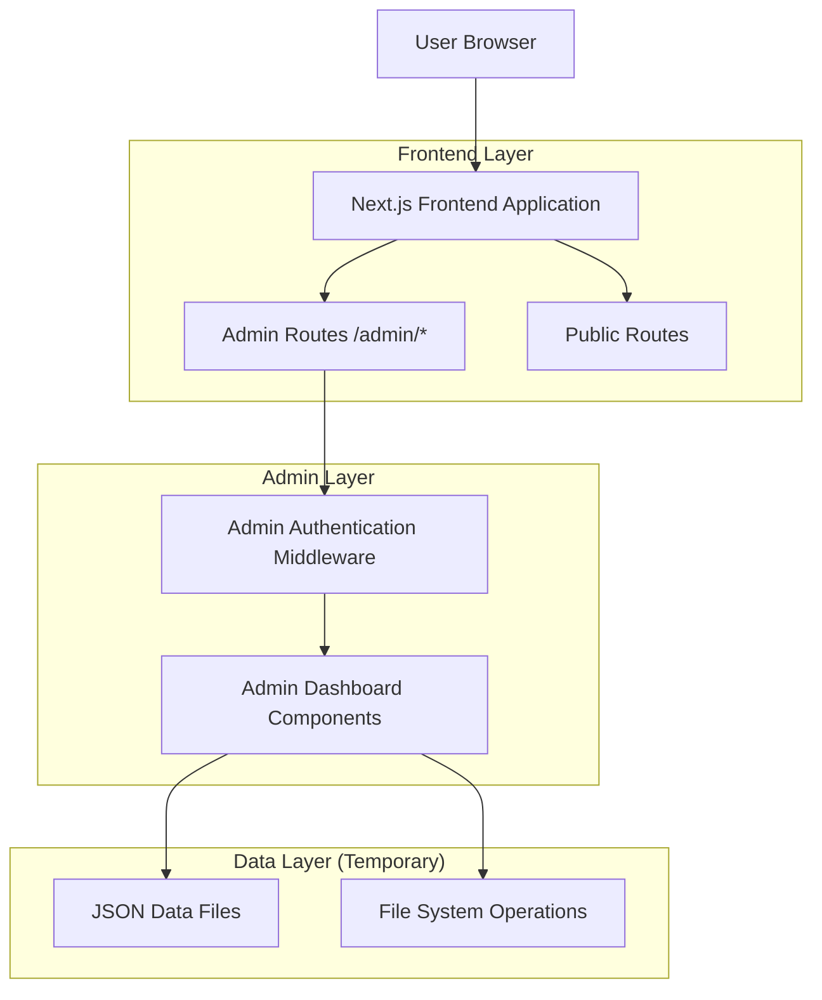
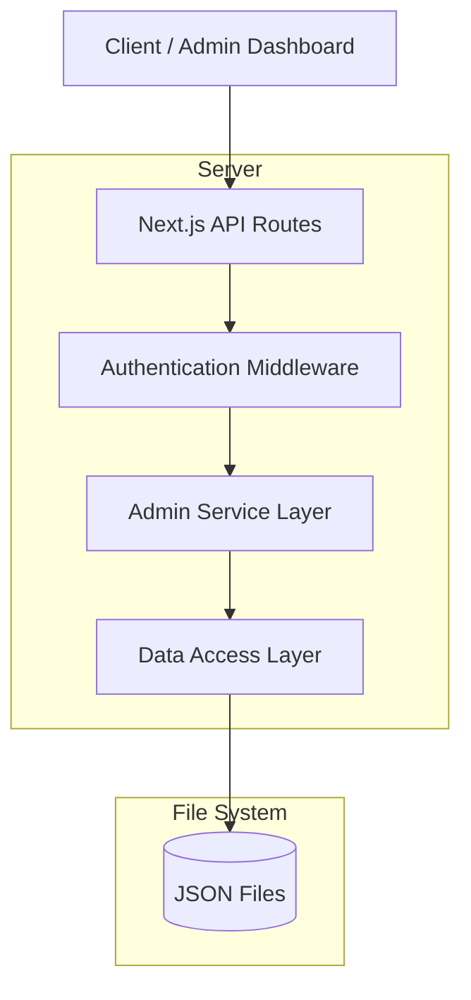
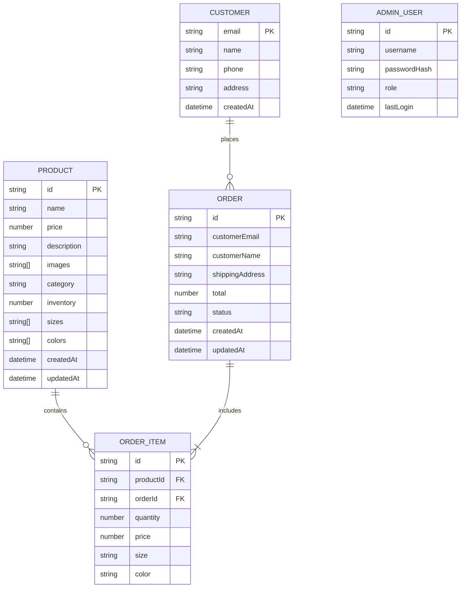

# Admin Dashboard Technical Architecture

## 1. Architecture Design



## 2. Technology Description

- **Frontend**: React@18 + Next.js@15 + TypeScript + Tailwind CSS
- **State Management**: Zustand + React Context
- **Authentication**: Environment-based simple auth (temporary)
- **Data Storage**: JSON files + File System API (temporary)
- **UI Components**: Custom component library + Lucide React icons
- **Animations**: Framer Motion
- **Styling**: Tailwind CSS with custom Gilroy font

## 3. Route Definitions

| Route | Purpose |
|-------|----------|
| /admin | Admin dashboard home with overview metrics |
| /admin/login | Admin authentication page |
| /admin/products | Product management list view |
| /admin/products/new | Create new product form |
| /admin/products/[id] | Product details view |
| /admin/products/[id]/edit | Edit product form |
| /admin/orders | Order management list view |
| /admin/orders/[id] | Order details and status management |
| /admin/analytics | Analytics dashboard with charts and metrics |
| /admin/settings | Store configuration and settings |

## 4. API Definitions

### 4.1 Core API

**Admin Authentication**
```
POST /api/admin/auth/login
```

Request:
| Param Name | Param Type | isRequired | Description |
|------------|------------|------------|-------------|
| username | string | true | Admin username |
| password | string | true | Admin password |

Response:
| Param Name | Param Type | Description |
|------------|------------|-------------|
| success | boolean | Authentication status |
| token | string | Session token (if successful) |
| message | string | Error message (if failed) |

Example:
```json
{
  "username": "admin",
  "password": "secure_password"
}
```

**Product Management**
```
GET /api/admin/products
POST /api/admin/products
PUT /api/admin/products/[id]
DELETE /api/admin/products/[id]
```

Product Request:
| Param Name | Param Type | isRequired | Description |
|------------|------------|------------|-------------|
| name | string | true | Product name |
| price | number | true | Product price |
| description | string | true | Product description |
| images | string[] | true | Array of image URLs |
| category | string | true | Product category |
| inventory | number | true | Stock quantity |
| sizes | string[] | false | Available sizes |
| colors | string[] | false | Available colors |

**Order Management**
```
GET /api/admin/orders
PUT /api/admin/orders/[id]/status
```

Order Status Update:
| Param Name | Param Type | isRequired | Description |
|------------|------------|------------|-------------|
| status | string | true | New order status (pending, processing, shipped, delivered, cancelled) |
| notes | string | false | Admin notes |

**Analytics**
```
GET /api/admin/analytics/overview
GET /api/admin/analytics/sales
GET /api/admin/analytics/products
```

## 5. Server Architecture Diagram



## 6. Data Model

### 6.1 Data Model Definition



### 6.2 Data Definition Language

**Products Data Structure (products.json)**
```json
{
  "products": [
    {
      "id": "prod_001",
      "name": "Classic T-Shirt",
      "price": 29.99,
      "description": "Comfortable cotton t-shirt",
      "images": ["/images/tshirt-1.jpg", "/images/tshirt-2.jpg"],
      "category": "clothing",
      "inventory": 100,
      "sizes": ["XS", "S", "M", "L", "XL"],
      "colors": ["black", "white", "gray"],
      "createdAt": "2024-01-01T00:00:00Z",
      "updatedAt": "2024-01-01T00:00:00Z"
    }
  ]
}
```

**Orders Data Structure (orders.json)**
```json
{
  "orders": [
    {
      "id": "order_001",
      "customerEmail": "customer@example.com",
      "customerName": "John Doe",
      "shippingAddress": {
        "street": "123 Main St",
        "city": "New York",
        "state": "NY",
        "zipCode": "10001",
        "country": "USA"
      },
      "items": [
        {
          "productId": "prod_001",
          "quantity": 2,
          "price": 29.99,
          "size": "M",
          "color": "black"
        }
      ],
      "total": 59.98,
      "status": "pending",
      "createdAt": "2024-01-01T00:00:00Z",
      "updatedAt": "2024-01-01T00:00:00Z"
    }
  ]
}
```

**Admin Users Data Structure (admin-users.json)**
```json
{
  "users": [
    {
      "id": "admin_001",
      "username": "admin",
      "passwordHash": "$2b$10$...",
      "role": "super_admin",
      "lastLogin": "2024-01-01T00:00:00Z",
      "createdAt": "2024-01-01T00:00:00Z"
    }
  ]
}
```

**Settings Data Structure (settings.json)**
```json
{
  "store": {
    "name": "Espada Store",
    "email": "contact@espada.com",
    "phone": "+1-555-0123",
    "address": {
      "street": "123 Business Ave",
      "city": "New York",
      "state": "NY",
      "zipCode": "10001",
      "country": "USA"
    }
  },
  "shipping": {
    "freeShippingThreshold": 100,
    "standardRate": 9.99,
    "expressRate": 19.99,
    "internationalRate": 29.99
  },
  "tax": {
    "rate": 0.08,
    "enabled": true
  },
  "currency": {
    "code": "USD",
    "symbol": "$"
  }
}
```

## 7. Component Architecture

### 7.1 Admin Layout Structure
```typescript
// components/admin/layout/AdminLayout.tsx
interface AdminLayoutProps {
  children: React.ReactNode
  title?: string
}

// Layout includes:
// - AdminHeader (logout, user info)
// - AdminSidebar (navigation)
// - Main content area
// - Breadcrumbs
```

### 7.2 Data Management Hooks
```typescript
// hooks/admin/useProducts.ts
export const useProducts = () => {
  const [products, setProducts] = useState<Product[]>([])
  const [loading, setLoading] = useState(false)
  
  const fetchProducts = async () => { /* ... */ }
  const createProduct = async (product: CreateProductData) => { /* ... */ }
  const updateProduct = async (id: string, updates: UpdateProductData) => { /* ... */ }
  const deleteProduct = async (id: string) => { /* ... */ }
  
  return { products, loading, fetchProducts, createProduct, updateProduct, deleteProduct }
}
```

### 7.3 Authentication Context
```typescript
// contexts/AdminAuthContext.tsx
interface AdminAuthContextType {
  isAuthenticated: boolean
  user: AdminUser | null
  login: (username: string, password: string) => Promise<boolean>
  logout: () => void
  loading: boolean
}
```

## 8. Security Implementation

### 8.1 Middleware Protection
```typescript
// middleware.ts
export function middleware(request: NextRequest) {
  const { pathname } = request.nextUrl
  
  if (pathname.startsWith('/admin') && pathname !== '/admin/login') {
    const token = request.cookies.get('admin-token')?.value
    
    if (!token || !verifyAdminToken(token)) {
      return NextResponse.redirect(new URL('/admin/login', request.url))
    }
  }
  
  return NextResponse.next()
}
```

### 8.2 Environment Configuration
```bash
# .env.local
ADMIN_USERNAME=admin
ADMIN_PASSWORD_HASH=$2b$10$...
ADMIN_JWT_SECRET=your-secret-key
NODE_ENV=development
```

## 9. File Operations

### 9.1 Data Access Layer
```typescript
// lib/admin/dataAccess.ts
export class DataAccess {
  private dataDir = path.join(process.cwd(), 'data')
  
  async readData<T>(filename: string): Promise<T> {
    const filePath = path.join(this.dataDir, filename)
    const data = await fs.readFile(filePath, 'utf-8')
    return JSON.parse(data)
  }
  
  async writeData<T>(filename: string, data: T): Promise<void> {
    const filePath = path.join(this.dataDir, filename)
    await fs.writeFile(filePath, JSON.stringify(data, null, 2))
  }
}
```

## 10. Migration Strategy

### 10.1 Database Migration Path
When implementing a proper database:

1. **Data Export**: Create scripts to export JSON data to SQL/NoSQL format
2. **API Refactoring**: Replace file operations with database queries
3. **Schema Migration**: Convert JSON structures to database schemas
4. **Authentication Upgrade**: Implement proper user management

### 10.2 Scalability Considerations
- Implement pagination for large datasets
- Add caching layer for frequently accessed data
- Optimize file I/O operations
- Prepare for horizontal scaling

This technical architecture provides a solid foundation for the admin dashboard while maintaining flexibility for future enhancements an