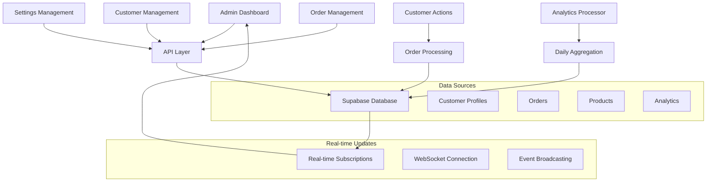

# Admin System Hardcoded Data Analysis & Live Data Migration Plan

## 1. Current State Analysis

### 1.1 Identified Hardcoded Data Sources

#### **Admin Settings Page (`/app/admin/settings/page.tsx`)**
- **Store Configuration**: Hardcoded store name, description, contact info
- **Notification Preferences**: Static boolean values for email, order, stock alerts
- **Security Settings**: Hardcoded 2FA, session timeout, password requirements
- **Appearance Settings**: Static theme, color, logo URL values
- **Save Functionality**: Mock API call with setTimeout simulation

```typescript
// Current hardcoded settings
const [settings, setSettings] = useState<SettingsData>({
  general: {
    storeName: 'Espada Store',
    storeDescription: 'Premium fashion and accessories',
    contactEmail: 'admin@espada.com',
    contactPhone: '+1 (555) 123-4567',
    timezone: 'America/New_York',
    currency: 'USD'
  },
  // ... more hardcoded values
});
```

#### **Customer Management (`/app/admin/customers/page.tsx`)**
- **Mock Customer Data**: 3 hardcoded customer records with fake information
- **Simulated API Calls**: setTimeout-based fake CRUD operations
- **No Database Integration**: All operations are in-memory only

```typescript
// Current mock data
const mockCustomers: Customer[] = [
  {
    id: '1',
    name: 'John Doe',
    email: 'john.doe@example.com',
    // ... more fake data
  }
];
```

#### **Orders Data (`/data/admin/orders.json`)**
- **Static JSON File**: 5 hardcoded order records
- **No Real-time Updates**: Orders don't reflect actual customer purchases
- **Inconsistent Data**: Order data doesn't match customer profiles

#### **Analytics Dashboard (`/app/admin/page.tsx`)**
- **Calculated from Mock Data**: Analytics based on static JSON orders
- **Missing Real-time Metrics**: No live revenue, customer, or inventory tracking
- **Hardcoded Navigation Cards**: Static stats and descriptions

### 1.2 Missing Database Schemas

#### **Admin Settings Table**
- No database table for storing admin configuration
- Settings are lost on page refresh
- No version control or audit trail

#### **Customer Profiles Integration**
- Customer data not connected to Supabase auth users
- Missing customer profile management
- No order history integration

#### **Real-time Analytics Sources**
- No aggregated analytics tables
- Missing time-series data for trends
- No caching layer for performance

## 2. Database Schema Requirements

### 2.1 Admin Settings Schema

```sql
-- Admin settings table
CREATE TABLE admin_settings (
  id UUID PRIMARY KEY DEFAULT gen_random_uuid(),
  category VARCHAR(50) NOT NULL, -- 'general', 'notifications', 'security', 'appearance'
  key VARCHAR(100) NOT NULL,
  value JSONB NOT NULL,
  created_at TIMESTAMP WITH TIME ZONE DEFAULT NOW(),
  updated_at TIMESTAMP WITH TIME ZONE DEFAULT NOW(),
  UNIQUE(category, key)
);

-- Indexes for performance
CREATE INDEX idx_admin_settings_category ON admin_settings(category);
CREATE INDEX idx_admin_settings_key ON admin_settings(key);

-- Initial data
INSERT INTO admin_settings (category, key, value) VALUES
('general', 'store_config', '{"storeName": "Espada Store", "storeDescription": "Premium fashion and accessories", "contactEmail": "admin@espada.com", "contactPhone": "+1 (555) 123-4567", "timezone": "America/New_York", "currency": "USD"}'),
('notifications', 'preferences', '{"emailNotifications": true, "orderNotifications": true, "lowStockAlerts": true, "customerSignups": false}'),
('security', 'policies', '{"twoFactorAuth": false, "sessionTimeout": 30, "passwordRequirements": true}'),
('appearance', 'theme_config', '{"theme": "light", "primaryColor": "#3B82F6", "logoUrl": ""}');
```

### 2.2 Enhanced Customer Profiles Schema

```sql
-- Customer profiles table (extends Supabase auth.users)
CREATE TABLE customer_profiles (
  id UUID PRIMARY KEY REFERENCES auth.users(id) ON DELETE CASCADE,
  first_name VARCHAR(100),
  last_name VARCHAR(100),
  phone VARCHAR(20),
  date_of_birth DATE,
  gender VARCHAR(20),
  status VARCHAR(20) DEFAULT 'active' CHECK (status IN ('active', 'inactive', 'suspended')),
  total_orders INTEGER DEFAULT 0,
  total_spent DECIMAL(10,2) DEFAULT 0.00,
  last_order_date TIMESTAMP WITH TIME ZONE,
  created_at TIMESTAMP WITH TIME ZONE DEFAULT NOW(),
  updated_at TIMESTAMP WITH TIME ZONE DEFAULT NOW()
);

-- Customer addresses table
CREATE TABLE customer_addresses (
  id UUID PRIMARY KEY DEFAULT gen_random_uuid(),
  customer_id UUID REFERENCES customer_profiles(id) ON DELETE CASCADE,
  type VARCHAR(20) DEFAULT 'shipping' CHECK (type IN ('shipping', 'billing')),
  street_address TEXT NOT NULL,
  city VARCHAR(100) NOT NULL,
  state VARCHAR(100),
  postal_code VARCHAR(20),
  country VARCHAR(100) NOT NULL,
  is_default BOOLEAN DEFAULT false,
  created_at TIMESTAMP WITH TIME ZONE DEFAULT NOW()
);

-- Indexes
CREATE INDEX idx_customer_profiles_status ON customer_profiles(status);
CREATE INDEX idx_customer_profiles_total_spent ON customer_profiles(total_spent DESC);
CREATE INDEX idx_customer_addresses_customer_id ON customer_addresses(customer_id);
```

### 2.3 Analytics Data Sources Schema

```sql
-- Daily analytics aggregation table
CREATE TABLE daily_analytics (
  date DATE PRIMARY KEY,
  total_orders INTEGER DEFAULT 0,
  total_revenue DECIMAL(12,2) DEFAULT 0.00,
  unique_customers INTEGER DEFAULT 0,
  new_customers INTEGER DEFAULT 0,
  average_order_value DECIMAL(10,2) DEFAULT 0.00,
  created_at TIMESTAMP WITH TIME ZONE DEFAULT NOW()
);

-- Product performance analytics
CREATE TABLE product_analytics (
  id UUID PRIMARY KEY DEFAULT gen_random_uuid(),
  product_id UUID REFERENCES products(id) ON DELETE CASCADE,
  date DATE NOT NULL,
  views INTEGER DEFAULT 0,
  orders INTEGER DEFAULT 0,
  revenue DECIMAL(10,2) DEFAULT 0.00,
  UNIQUE(product_id, date)
);

-- Customer behavior analytics
CREATE TABLE customer_analytics (
  id UUID PRIMARY KEY DEFAULT gen_random_uuid(),
  customer_id UUID REFERENCES customer_profiles(id) ON DELETE CASCADE,
  date DATE NOT NULL,
  sessions INTEGER DEFAULT 0,
  page_views INTEGER DEFAULT 0,
  time_spent INTEGER DEFAULT 0, -- in seconds
  orders INTEGER DEFAULT 0,
  UNIQUE(customer_id, date)
);

-- Indexes for analytics
CREATE INDEX idx_daily_analytics_date ON daily_analytics(date DESC);
CREATE INDEX idx_product_analytics_date ON product_analytics(date DESC);
CREATE INDEX idx_product_analytics_product_id ON product_analytics(product_id);
CREATE INDEX idx_customer_analytics_date ON customer_analytics(date DESC);
```

## 3. Implementation Plan

### 3.1 Phase 1: Database Setup & Migrations

#### **Step 1: Create Database Schemas**
```bash
# Create migration files
supabase migration new admin_settings_schema
supabase migration new enhanced_customer_profiles
supabase migration new analytics_tables
```

#### **Step 2: Set Up Row Level Security (RLS)**
```sql
-- Admin settings RLS
ALTER TABLE admin_settings ENABLE ROW LEVEL SECURITY;
CREATE POLICY "Admin full access" ON admin_settings FOR ALL TO authenticated USING (auth.jwt() ->> 'role' = 'admin');

-- Customer profiles RLS
ALTER TABLE customer_profiles ENABLE ROW LEVEL SECURITY;
CREATE POLICY "Admin full access" ON customer_profiles FOR ALL TO authenticated USING (auth.jwt() ->> 'role' = 'admin');
CREATE POLICY "Users can view own profile" ON customer_profiles FOR SELECT TO authenticated USING (auth.uid() = id);
```

### 3.2 Phase 2: API Endpoints Development

#### **Admin Settings API (`/app/api/admin/settings/`)**

```typescript
// GET /api/admin/settings - Fetch all settings
export const GET = withStackAdminAuth(async (request, admin) => {
  const { data: settings, error } = await supabaseAdmin
    .from('admin_settings')
    .select('*');
    
  if (error) throw error;
  
  // Transform to expected format
  const transformedSettings = settings.reduce((acc, setting) => {
    if (!acc[setting.category]) acc[setting.category] = {};
    acc[setting.category] = { ...acc[setting.category], ...setting.value };
    return acc;
  }, {});
  
  return NextResponse.json(transformedSettings);
});

// PUT /api/admin/settings - Update settings
export const PUT = withStackAdminAuth(async (request, admin) => {
  const { category, updates } = await request.json();
  
  const { error } = await supabaseAdmin
    .from('admin_settings')
    .upsert({
      category,
      key: Object.keys(updates)[0],
      value: updates,
      updated_at: new Date().toISOString()
    });
    
  if (error) throw error;
  return NextResponse.json({ success: true });
});
```

#### **Customer Management API (`/app/api/admin/customers/`)**

```typescript
// GET /api/admin/customers - Fetch customers with pagination
export const GET = withStackAdminAuth(async (request, admin) => {
  const { searchParams } = new URL(request.url);
  const page = parseInt(searchParams.get('page') || '1');
  const limit = parseInt(searchParams.get('limit') || '10');
  const search = searchParams.get('search') || '';
  const status = searchParams.get('status') || 'all';
  
  let query = supabaseAdmin
    .from('customer_profiles')
    .select(`
      *,
      customer_addresses(*)
    `)
    .range((page - 1) * limit, page * limit - 1);
    
  if (search) {
    query = query.or(`first_name.ilike.%${search}%,last_name.ilike.%${search}%,email.ilike.%${search}%`);
  }
  
  if (status !== 'all') {
    query = query.eq('status', status);
  }
  
  const { data: customers, error } = await query;
  if (error) throw error;
  
  return NextResponse.json({ customers });
});
```

#### **Real-time Analytics API (`/app/api/admin/analytics/real-time/`)**

```typescript
// GET /api/admin/analytics/real-time - Live analytics data
export const GET = withStackAdminAuth(async (request, admin) => {
  const { searchParams } = new URL(request.url);
  const timeRange = searchParams.get('timeRange') || '30';
  
  // Get real-time metrics
  const [ordersResult, customersResult, revenueResult] = await Promise.all([
    supabaseAdmin.from('orders').select('count', { count: 'exact' }),
    supabaseAdmin.from('customer_profiles').select('count', { count: 'exact' }),
    supabaseAdmin.from('orders').select('total').eq('status', 'completed')
  ]);
  
  const totalRevenue = revenueResult.data?.reduce((sum, order) => sum + order.total, 0) || 0;
  
  return NextResponse.json({
    totalOrders: ordersResult.count || 0,
    totalCustomers: customersResult.count || 0,
    totalRevenue,
    // ... more real-time metrics
  });
});
```

### 3.3 Phase 3: Component Updates

#### **Settings Page Migration**

```typescript
// Updated settings page with live data
export default function SettingsPage() {
  const [settings, setSettings] = useState<SettingsData>({});
  const [loading, setLoading] = useState(true);
  const [saving, setSaving] = useState(false);

  useEffect(() => {
    loadSettings();
  }, []);

  const loadSettings = async () => {
    try {
      const response = await fetch('/api/admin/settings');
      const data = await response.json();
      setSettings(data);
    } catch (error) {
      console.error('Failed to load settings:', error);
    } finally {
      setLoading(false);
    }
  };

  const handleSave = async () => {
    setSaving(true);
    try {
      await fetch('/api/admin/settings', {
        method: 'PUT',
        headers: { 'Content-Type': 'application/json' },
        body: JSON.stringify(settings)
      });
      // Show success message
    } catch (error) {
      console.error('Failed to save settings:', error);
    } finally {
      setSaving(false);
    }
  };

  // ... rest of component
}
```

#### **Customer Page Migration**

```typescript
// Updated customers page with live data
export default function CustomersPage() {
  const [customers, setCustomers] = useState<Customer[]>([]);
  const [loading, setLoading] = useState(true);
  const [pagination, setPagination] = useState({ page: 1, total: 0 });

  useEffect(() => {
    loadCustomers();
  }, [searchTerm, filterStatus, pagination.page]);

  const loadCustomers = async () => {
    try {
      const params = new URLSearchParams({
        page: pagination.page.toString(),
        search: searchTerm,
        status: filterStatus
      });
      
      const response = await fetch(`/api/admin/customers?${params}`);
      const data = await response.json();
      setCustomers(data.customers);
    } catch (error) {
      console.error('Failed to load customers:', error);
    } finally {
      setLoading(false);
    }
  };

  // ... rest of component with real CRUD operations
}
```

### 3.4 Phase 4: Data Synchronization Strategy

#### **Real-time Updates with Supabase Realtime**

```typescript
// Real-time subscription for admin dashboard
useEffect(() => {
  const channel = supabase
    .channel('admin-updates')
    .on('postgres_changes', 
      { event: '*', schema: 'public', table: 'orders' },
      (payload) => {
        // Update orders in real-time
        updateOrdersData(payload);
      }
    )
    .on('postgres_changes',
      { event: '*', schema: 'public', table: 'customer_profiles' },
      (payload) => {
        // Update customer data in real-time
        updateCustomersData(payload);
      }
    )
    .subscribe();

  return () => {
    supabase.removeChannel(channel);
  };
}, []);
```

#### **Background Analytics Processing**

```typescript
// Scheduled function to update daily analytics
export async function updateDailyAnalytics() {
  const today = new Date().toISOString().split('T')[0];
  
  // Calculate daily metrics
  const [ordersData, customersData, revenueData] = await Promise.all([
    supabaseAdmin.from('orders').select('*').gte('created_at', today),
    supabaseAdmin.from('customer_profiles').select('*').gte('created_at', today),
    supabaseAdmin.from('orders').select('total').eq('status', 'completed').gte('created_at', today)
  ]);
  
  const dailyStats = {
    date: today,
    total_orders: ordersData.data?.length || 0,
    new_customers: customersData.data?.length || 0,
    total_revenue: revenueData.data?.reduce((sum, order) => sum + order.total, 0) || 0,
    // ... more calculations
  };
  
  // Upsert daily analytics
  await supabaseAdmin
    .from('daily_analytics')
    .upsert(dailyStats);
}
```

## 4. Technical Architecture

### 4.1 Live Data Flow Design



### 4.2 Caching Strategy for Performance

#### **Redis Caching Layer**

```typescript
// Cache frequently accessed data
const cacheKeys = {
  ADMIN_SETTINGS: 'admin:settings',
  DAILY_ANALYTICS: 'analytics:daily',
  CUSTOMER_STATS: 'customers:stats'
};

// Cache implementation
export class AdminCache {
  static async getSettings() {
    const cached = await redis.get(cacheKeys.ADMIN_SETTINGS);
    if (cached) return JSON.parse(cached);
    
    // Fetch from database and cache
    const settings = await fetchSettingsFromDB();
    await redis.setex(cacheKeys.ADMIN_SETTINGS, 3600, JSON.stringify(settings));
    return settings;
  }
  
  static async invalidateSettings() {
    await redis.del(cacheKeys.ADMIN_SETTINGS);
  }
}
```

#### **Client-side Caching with React Query**

```typescript
// React Query setup for admin data
export function useAdminSettings() {
  return useQuery({
    queryKey: ['admin', 'settings'],
    queryFn: () => fetch('/api/admin/settings').then(res => res.json()),
    staleTime: 5 * 60 * 1000, // 5 minutes
    cacheTime: 10 * 60 * 1000, // 10 minutes
  });
}

export function useCustomers(filters: CustomerFilters) {
  return useQuery({
    queryKey: ['admin', 'customers', filters],
    queryFn: () => fetchCustomers(filters),
    keepPreviousData: true,
    staleTime: 2 * 60 * 1000, // 2 minutes
  });
}
```

### 4.3 Error Handling and Fallbacks

#### **Graceful Degradation**

```typescript
// Error boundary for admin components
export class AdminErrorBoundary extends Component {
  state = { hasError: false, error: null };
  
  static getDerivedStateFromError(error: Error) {
    return { hasError: true, error };
  }
  
  render() {
    if (this.state.hasError) {
      return (
        <div className="p-6 text-center">
          <h2>Something went wrong</h2>
          <p>Unable to load admin data. Please try refreshing the page.</p>
          <button onClick={() => window.location.reload()}>
            Refresh Page
          </button>
        </div>
      );
    }
    
    return this.props.children;
  }
}
```

#### **Offline Support**

```typescript
// Service worker for offline admin functionality
self.addEventListener('fetch', (event) => {
  if (event.request.url.includes('/api/admin/')) {
    event.respondWith(
      fetch(event.request)
        .catch(() => {
          // Return cached data or offline message
          return caches.match('/offline-admin.json');
        })
    );
  }
});
```

## 5. Migration Timeline

### **Week 1: Database Setup**
- [ ] Create database schemas and migrations
- [ ] Set up RLS policies
- [ ] Seed initial admin settings data

### **Week 2: API Development**
- [ ] Implement admin settings API endpoints
- [ ] Create customer management APIs
- [ ] Build real-time analytics endpoints

### **Week 3: Component Migration**
- [ ] Update settings page with live data
- [ ] Migrate customer management page
- [ ] Implement real-time dashboard updates

### **Week 4: Testing & Optimization**
- [ ] Performance testing and optimization
- [ ] Error handling implementation
- [ ] Caching layer setup
- [ ] Real-time functionality testing

### **Week 5: Deployment & Monitoring**
- [ ] Production deployment
- [ ] Monitoring setup
- [ ] Data migration from mock to live
- [ ] User acceptance testing

## 6. Success Metrics

### **Performance Targets**
- Page load time: < 2 seconds
- API response time: < 500ms
- Real-time update latency: < 100ms
- Cache hit ratio: > 80%

### **Functionality Goals**
- 100% elimination of hardcoded data
- Real-time data synchronization
- Persistent admin settings
- Live customer management
- Accurate analytics reporting

### **Monitoring & Alerts**
- Database query performance
- API endpoint availability
- Real-time connection health
- Cache performance metrics
- Error rate tracking

This comprehensive migration plan will transform your admin system from a mock data interface to a fully functional, database-driven administration platform with real-time capabilities and robust performance optimization.