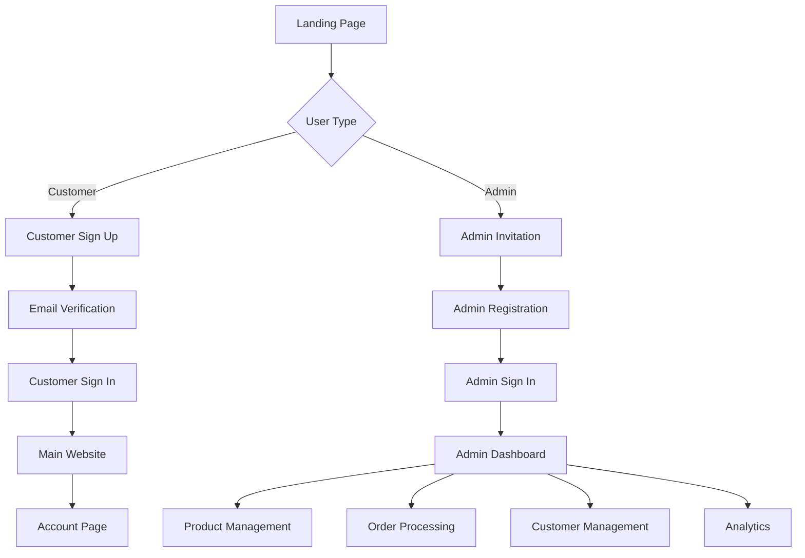
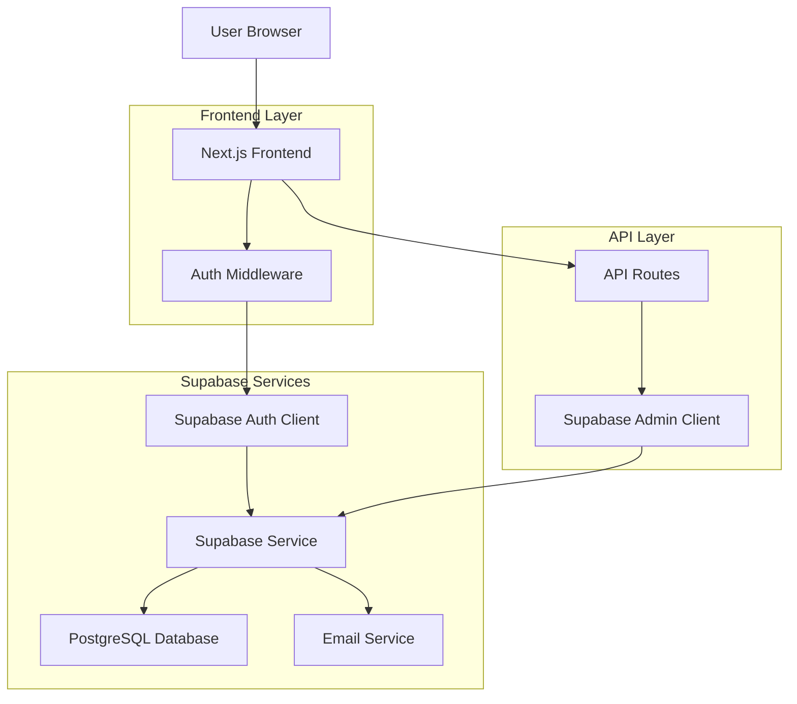

# Espada Authentication System Implementation Guide

## 1. Product Overview

This document outlines the implementation of a comprehensive authentication system for the Espada e-commerce platform using Supabase Auth. The system provides role-based access control with distinct user flows for administrators and customers, ensuring secure access to appropriate features and data.

The authentication system leverages Supabase's built-in authentication capabilities combined with custom role management to create a seamless experience where admins are directed to the admin dashboard while customers access the main website and their account pages.

## 2. Core Features

### 2.1 User Roles

| Role | Registration Method | Core Permissions |
|------|---------------------|------------------|
| Customer | Email registration with verification | Can browse products, place orders, manage profile, view order history |
| Admin | Invitation-based registration | Can manage products, process orders, view analytics, manage customers, send notifications |

### 2.2 Feature Module

Our authentication system consists of the following main pages:
1. **Sign In page**: Universal login with role-based redirection, password reset functionality.
2. **Sign Up page**: Customer registration with email verification, terms acceptance.
3. **Admin Login page**: Dedicated admin authentication with enhanced security.
4. **Account page**: Customer profile management, order history, address management.
5. **Admin Dashboard**: Complete admin interface with analytics, product management, order processing.
6. **Email Verification page**: Handle email confirmation callbacks.
7. **Password Reset page**: Secure password reset flow.

### 2.3 Page Details

| Page Name | Module Name | Feature description |
|-----------|-------------|---------------------|
| Sign In | Authentication Form | Email/password login, remember me option, forgot password link, role-based redirection |
| Sign Up | Registration Form | Customer registration with email verification, password strength validation, terms acceptance |
| Admin Login | Admin Authentication | Dedicated admin login with enhanced security, admin-only access verification |
| Account Dashboard | Profile Management | Customer profile editing, order history viewing, address management, password change |
| Admin Dashboard | Admin Interface | Analytics overview, product management, order processing, customer management |
| Email Verification | Auth Callback | Handle Supabase auth callbacks, email confirmation, account activation |
| Password Reset | Security Flow | Secure password reset with email verification, new password setup |

## 3. Core Process

### Customer Flow
1. Customer visits sign-up page and creates account with email verification
2. Email verification link redirects to confirmation page
3. Customer signs in and is redirected to main website
4. Customer can access account page for profile management and order history
5. Customer can place orders and track order status

### Admin Flow
1. Admin receives invitation email with secure registration link
2. Admin completes registration and is added to admins table
3. Admin signs in through dedicated admin login page
4. Admin is redirected to admin dashboard with full management capabilities
5. Admin can manage products, process orders, view analytics, and manage customers



## 4. User Interface Design

### 4.1 Design Style
- **Primary Colors**: Black (#000000), White (#FFFFFF)
- **Secondary Colors**: Gray (#6B7280), Light Gray (#F3F4F6)
- **Button Style**: Rounded corners (8px), clean minimalist design
- **Font**: Gilroy font family with multiple weights
- **Layout Style**: Card-based design with clean spacing, top navigation
- **Icons**: Lucide React icons for consistency

### 4.2 Page Design Overview

| Page Name | Module Name | UI Elements |
|-----------|-------------|-------------|
| Sign In | Authentication Form | Centered card layout, email/password inputs, primary CTA button, secondary links, loading states |
| Sign Up | Registration Form | Multi-step form with validation, progress indicator, email verification notice, terms checkbox |
| Admin Login | Admin Interface | Dark theme card, enhanced security indicators, admin branding, secure login form |
| Account Dashboard | Profile Management | Sidebar navigation, profile form sections, order history table, responsive grid layout |
| Admin Dashboard | Management Interface | Dark sidebar navigation, analytics cards, data tables, action buttons, modal dialogs |

### 4.3 Responsiveness
The authentication system is mobile-first with responsive design ensuring optimal experience across desktop, tablet, and mobile devices. Touch-friendly interfaces are implemented for mobile users with appropriate button sizes and spacing.

## 5. Technical Architecture

### 5.1 Architecture Design



### 5.2 Technology Stack
- **Frontend**: React@18 + Next.js@14 + TypeScript + Tailwind CSS
- **Authentication**: Supabase Auth + Custom Role Management
- **Database**: Supabase (PostgreSQL) with Row Level Security
- **Email**: Supabase Email Service
- **State Management**: React Context + Custom Hooks

### 5.3 Route Definitions

| Route | Purpose |
|-------|---------|
| `/signin` | Universal sign-in page with role-based redirection |
| `/signup` | Customer registration with email verification |
| `/admin/login` | Dedicated admin authentication page |
| `/account` | Customer account dashboard and profile management |
| `/admin` | Protected admin dashboard with full management capabilities |
| `/auth/callback` | Supabase auth callback handler for email verification |
| `/auth/reset-password` | Password reset flow with secure token validation |
| `/auth/verify-email` | Email verification confirmation page |

## 6. Database Schema

### 6.1 Existing Tables Analysis

Based on the codebase analysis, the following tables are already implemented:

```sql
-- Supabase Auth Users (managed by Supabase)
-- auth.users table is automatically created

-- Admins table (existing)
CREATE TABLE admins (
    id UUID PRIMARY KEY DEFAULT gen_random_uuid(),
    user_id UUID REFERENCES auth.users(id) ON DELETE CASCADE,
    email VARCHAR(255) UNIQUE NOT NULL,
    created_at TIMESTAMP WITH TIME ZONE DEFAULT NOW()
);

-- Customer Profiles table (existing)
CREATE TABLE customer_profiles (
    id UUID PRIMARY KEY DEFAULT gen_random_uuid(),
    user_id UUID REFERENCES auth.users(id) ON DELETE CASCADE,
    email VARCHAR(255) UNIQUE NOT NULL,
    full_name VARCHAR(255),
    phone VARCHAR(20),
    address JSONB,
    created_at TIMESTAMP WITH TIME ZONE DEFAULT NOW(),
    updated_at TIMESTAMP WITH TIME ZONE DEFAULT NOW()
);

-- Products table (existing)
CREATE TABLE products (
    id UUID PRIMARY KEY DEFAULT gen_random_uuid(),
    name VARCHAR(255) NOT NULL,
    description TEXT,
    price DECIMAL(10,2) NOT NULL,
    category VARCHAR(100),
    sizes TEXT[],
    colors TEXT[],
    images TEXT[],
    stock_quantity INTEGER DEFAULT 0,
    featured BOOLEAN DEFAULT false,
    status VARCHAR(20) DEFAULT 'active',
    created_at TIMESTAMP WITH TIME ZONE DEFAULT NOW(),
    updated_at TIMESTAMP WITH TIME ZONE DEFAULT NOW()
);

-- Orders table (existing)
CREATE TABLE orders (
    id UUID PRIMARY KEY DEFAULT gen_random_uuid(),
    customer_id UUID REFERENCES customer_profiles(id),
    customer_name VARCHAR(255),
    customer_email VARCHAR(255),
    items JSONB,
    total DECIMAL(10,2),
    status VARCHAR(50) DEFAULT 'pending',
    shipping_address JSONB,
    created_at TIMESTAMP WITH TIME ZONE DEFAULT NOW(),
    updated_at TIMESTAMP WITH TIME ZONE DEFAULT NOW()
);
```

### 6.2 Required Additional Tables

```sql
-- Email Notifications table
CREATE TABLE email_notifications (
    id UUID PRIMARY KEY DEFAULT gen_random_uuid(),
    recipient_email VARCHAR(255) NOT NULL,
    subject VARCHAR(255) NOT NULL,
    template_name VARCHAR(100) NOT NULL,
    template_data JSONB,
    status VARCHAR(50) DEFAULT 'pending',
    sent_at TIMESTAMP WITH TIME ZONE,
    error_message TEXT,
    created_at TIMESTAMP WITH TIME ZONE DEFAULT NOW()
);

-- Admin Invitations table
CREATE TABLE admin_invitations (
    id UUID PRIMARY KEY DEFAULT gen_random_uuid(),
    email VARCHAR(255) UNIQUE NOT NULL,
    token VARCHAR(255) UNIQUE NOT NULL,
    invited_by UUID REFERENCES auth.users(id),
    expires_at TIMESTAMP WITH TIME ZONE NOT NULL,
    used_at TIMESTAMP WITH TIME ZONE,
    created_at TIMESTAMP WITH TIME ZONE DEFAULT NOW()
);

-- User Sessions table (for enhanced security tracking)
CREATE TABLE user_sessions (
    id UUID PRIMARY KEY DEFAULT gen_random_uuid(),
    user_id UUID REFERENCES auth.users(id) ON DELETE CASCADE,
    session_token VARCHAR(255) UNIQUE NOT NULL,
    ip_address INET,
    user_agent TEXT,
    expires_at TIMESTAMP WITH TIME ZONE NOT NULL,
    created_at TIMESTAMP WITH TIME ZONE DEFAULT NOW()
);
```

### 6.3 Row Level Security Policies

```sql
-- Enable RLS on all tables
ALTER TABLE admins ENABLE ROW LEVEL SECURITY;
ALTER TABLE customer_profiles ENABLE ROW LEVEL SECURITY;
ALTER TABLE email_notifications ENABLE ROW LEVEL SECURITY;
ALTER TABLE admin_invitations ENABLE ROW LEVEL SECURITY;
ALTER TABLE user_sessions ENABLE ROW LEVEL SECURITY;

-- Admin table policies
CREATE POLICY "Admins can view all admin records" ON admins
    FOR SELECT TO authenticated
    USING (EXISTS (SELECT 1 FROM admins WHERE user_id = auth.uid()));

-- Customer profiles policies
CREATE POLICY "Users can view own profile" ON customer_profiles
    FOR SELECT TO authenticated
    USING (user_id = auth.uid());

CREATE POLICY "Users can update own profile" ON customer_profiles
    FOR UPDATE TO authenticated
    USING (user_id = auth.uid());

CREATE POLICY "Admins can view all profiles" ON customer_profiles
    FOR SELECT TO authenticated
    USING (EXISTS (SELECT 1 FROM admins WHERE user_id = auth.uid()));

-- Email notifications policies
CREATE POLICY "Admins can manage email notifications" ON email_notifications
    FOR ALL TO authenticated
    USING (EXISTS (SELECT 1 FROM admins WHERE user_id = auth.uid()));

-- Admin invitations policies
CREATE POLICY "Admins can manage invitations" ON admin_invitations
    FOR ALL TO authenticated
    USING (EXISTS (SELECT 1 FROM admins WHERE user_id = auth.uid()));

-- User sessions policies
CREATE POLICY "Users can view own sessions" ON user_sessions
    FOR SELECT TO authenticated
    USING (user_id = auth.uid());
```

## 7. API Endpoints

### 7.1 Authentication APIs

#### POST /api/auth/signin
Universal sign-in endpoint with role detection

**Request:**
| Param Name | Param Type | isRequired | Description |
|------------|------------|------------|-------------|
| email | string | true | User email address |
| password | string | true | User password |
| remember | boolean | false | Remember user session |

**Response:**
| Param Name | Param Type | Description |
|------------|------------|-------------|
| success | boolean | Authentication status |
| user | object | User information |
| role | string | User role (admin/customer) |
| redirectTo | string | Redirect URL based on role |

#### POST /api/auth/signup
Customer registration endpoint

**Request:**
| Param Name | Param Type | isRequired | Description |
|------------|------------|------------|-------------|
| email | string | true | Customer email |
| password | string | true | Customer password |
| fullName | string | true | Customer full name |
| phone | string | false | Customer phone number |

#### POST /api/auth/admin/invite
Admin invitation endpoint

**Request:**
| Param Name | Param Type | isRequired | Description |
|------------|------------|------------|-------------|
| email | string | true | Admin email to invite |
| role | string | false | Admin role level |

### 7.2 Profile Management APIs

#### GET /api/auth/profile
Get current user profile

#### PUT /api/auth/profile
Update user profile

#### POST /api/auth/change-password
Change user password

### 7.3 Email Notification APIs

#### POST /api/notifications/send
Send email notification

**Request:**
| Param Name | Param Type | isRequired | Description |
|------------|------------|------------|-------------|
| to | string | true | Recipient email |
| template | string | true | Email template name |
| data | object | true | Template data |

## 8. Implementation Steps

### Phase 1: Database Setup
1. Create additional required tables (email_notifications, admin_invitations, user_sessions)
2. Implement Row Level Security policies
3. Set up database indexes for performance
4. Create database functions for role management

### Phase 2: Authentication Infrastructure
1. Update Supabase Auth configuration
2. Implement auth middleware for route protection
3. Create auth context and hooks
4. Set up email templates in Supabase

### Phase 3: UI Components
1. Create sign-in and sign-up forms
2. Implement admin login page
3. Build account dashboard for customers
4. Create email verification pages
5. Implement password reset flow

### Phase 4: API Development
1. Create authentication API routes
2. Implement profile management endpoints
3. Build email notification system
4. Create admin invitation system

### Phase 5: Security & Testing
1. Implement comprehensive error handling
2. Add rate limiting and security measures
3. Test all authentication flows
4. Verify role-based access control

## 9. Security Considerations

### 9.1 Authentication Security <mcreference link="https://supabase.com/docs/guides/database/postgres/custom-claims-and-role-based-access-control-rbac" index="3">3</mcreference>
- Use Supabase's built-in security features
- Implement proper session management
- Use PKCE flow for enhanced security
- Enable email verification for all accounts

### 9.2 Authorization Security
- Implement Row Level Security policies
- Use server-side role verification
- Protect admin routes with middleware
- Validate user permissions on every request

### 9.3 Data Protection
- Encrypt sensitive data at rest
- Use HTTPS for all communications
- Implement proper CORS policies
- Regular security audits and updates

## 10. Email Notification System

### 10.1 Email Templates
- Welcome email for new customers
- Email verification
- Password reset
- Order confirmation
- Admin invitation
- Order status updates

### 10.2 Notification Triggers <mcreference link="https://supabase.com/docs/guides/getting-started/tutorials/with-nextjs" index="1">1</mcreference>
- User registration
- Order placement
- Order status changes
- Admin actions
- Security events

## 11. Monitoring and Analytics

### 11.1 Authentication Metrics
- Sign-up conversion rates
- Login success/failure rates
- Password reset frequency
- Email verification rates

### 11.2 Security Monitoring
- Failed login attempts
- Suspicious activity detection
- Session management
- Admin action logging

This comprehensive implementation guide provides the foundation for building a secure, scalable authentication system for the Espada e-commerce platform while leveraging existing infrastructure and following modern security best practices.