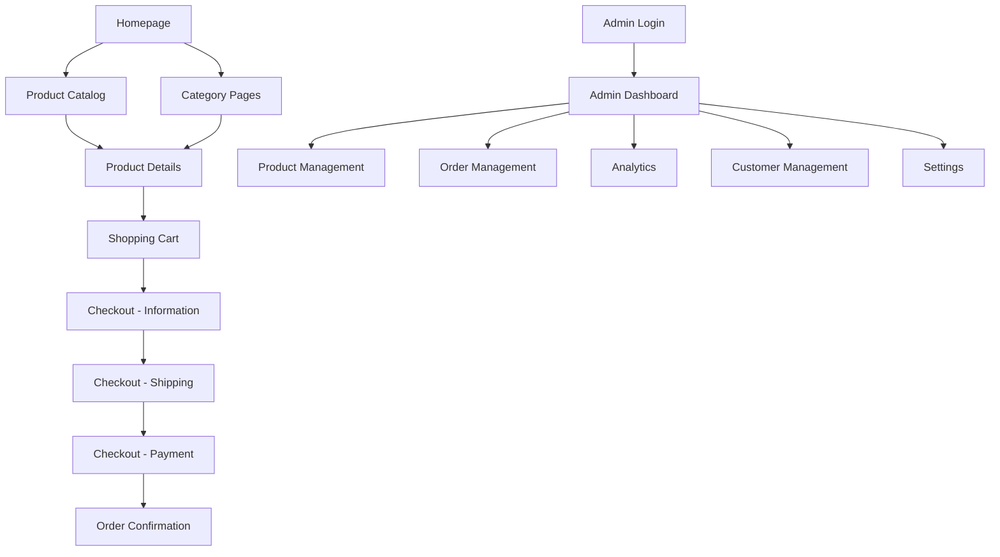

# Espada E-commerce Platform - Product Requirements Document

## 1. Product Overview

Espada is a premium minimalist streetwear e-commerce platform targeting style-conscious customers aged 18+ who appreciate quiet luxury and sustainable fashion. The platform combines a sophisticated customer-facing storefront with a comprehensive admin management system, built on modern web technologies with a focus on performance, accessibility, and user experience.

The platform serves as a digital gateway for a high-end unisex streetwear brand that emphasizes locally crafted excellence, minimalist aesthetics, and premium quality materials. With a price range of $20-$200+, Espada positions itself as accessible luxury in the streetwear market.

## 2. Core Features

### 2.1 User Roles

| Role | Registration Method | Core Permissions |
|------|---------------------|------------------|
| Customer | Email registration via app.stack | Browse products, manage cart, place orders, view order history |
| Admin | Secure admin login | Full access to admin panel, product management, order management, analytics |
| Guest User | No registration required | Browse products, add to cart (session-based) |

### 2.2 Feature Module

Our Espada platform consists of the following main pages:

1. **Homepage**: Hero section with brand showcase, featured collections (New This Week, XIV Collections), category navigation (Sudo, XVII, Teyo)
2. **Product Catalog**: Product grid with filtering, search, and category organization
3. **Product Details**: Individual product pages with image gallery, size/color selection, add to cart functionality
4. **Shopping Cart**: Cart management with quantity updates, item removal, and checkout initiation
5. **Checkout Flow**: Multi-step checkout with customer information, shipping details, and payment processing
6. **Admin Dashboard**: Comprehensive admin panel for business management
7. **Admin Login**: Secure authentication for admin access
8. **User Authentication**: Customer login/signup via app.stack integration

### 2.3 Page Details

| Page Name | Module Name | Feature description |
|-----------|-------------|---------------------|
| Homepage | Hero Section | Display brand imagery, featured products with hover effects, category navigation links |
| Homepage | Product Showcase | Display "New This Week" and "XIV Collections" with product grids, pricing, and wishlist functionality |
| Product Catalog | Product Grid | Display products with filtering by category, search functionality, pagination |
| Product Catalog | Filter System | Category filtering, price range, size availability, color options |
| Product Details | Product Gallery | Multiple product images with zoom, color/size variant switching |
| Product Details | Product Information | Name, price, description, size guide, stock availability, add to cart |
| Shopping Cart | Cart Management | View items, update quantities, remove items, calculate totals, apply discounts |
| Shopping Cart | Cart Persistence | Save cart state in localStorage, restore on return visits |
| Checkout | Customer Information | Collect email, phone, shipping address with validation |
| Checkout | Order Summary | Display cart items, shipping costs, taxes, total calculation |
| Checkout | Payment Processing | Integration with payment providers, order confirmation |
| Admin Dashboard | Analytics Overview | Sales metrics, order statistics, revenue tracking, performance indicators |
| Admin Dashboard | Product Management | CRUD operations for products, inventory tracking, category management |
| Admin Dashboard | Order Management | View orders, update status, customer communication, fulfillment tracking |
| Admin Dashboard | Customer Management | Customer database, order history, communication logs |
| Admin Login | Authentication | Secure login with session management, password protection |
| User Auth | Registration/Login | Customer account creation and authentication via app.stack |

## 3. Core Process

### Customer Shopping Flow
Customers begin their journey on the homepage, where they can explore featured collections and navigate to specific categories (Sudo, XVII, Teyo). From there, they browse the product catalog using filters and search functionality. Upon selecting a product, they view detailed information and add items to their cart. The checkout process guides them through providing contact information, shipping details, and payment, culminating in order confirmation.

### Admin Management Flow
Administrators access the system through a secure login page, then navigate to the admin dashboard where they can manage products (add, edit, delete), process orders (view, update status), analyze business metrics, and manage customer relationships. The admin panel provides comprehensive tools for inventory management, order fulfillment, and business intelligence.



## 4. User Interface Design

### 4.1 Design Style

**Primary Colors:**
- Black (#000000) - Primary brand color
- White (#FFFFFF) - Background and contrast
- Gray scale variations for semantic UI elements

**Secondary Colors:**
- Label Primary: High contrast text
- Label Secondary: Medium contrast text  
- Label Tertiary: Low contrast text
- Fill colors for backgrounds and surfaces

**Typography:**
- Primary Font: Gilroy (custom font family)
- Font weights: 100-950 (Thin to Heavy)
- Apple-inspired typography scale (Large Title, Title 1-3, Headline, Body, Callout, etc.)

**Button Style:**
- Rounded corners with subtle shadows
- Primary: Black background with white text
- Secondary: White background with black text
- Outline variants for secondary actions

**Layout Style:**
- Card-based design with subtle shadows
- Apple-inspired spacing using 8pt grid system
- Clean, minimalist layouts with ample whitespace
- Responsive grid systems

**Icons and Graphics:**
- Lucide React icon library for consistency
- Minimalist line icons
- Subtle hover animations using Framer Motion

### 4.2 Page Design Overview

| Page Name | Module Name | UI Elements |
|-----------|-------------|-------------|
| Homepage | Hero Section | Large typography (Large Title), high-quality product imagery, grain texture overlay, minimal navigation |
| Homepage | Product Grid | Card-based layout, hover animations, heart icons for wishlist, clean product imagery |
| Product Catalog | Filter Bar | Search input with icon, dropdown selects, clean button styling |
| Product Details | Image Gallery | Large product images, thumbnail navigation, zoom functionality |
| Shopping Cart | Cart Items | List layout with product images, quantity controls, remove buttons |
| Checkout | Form Layout | Multi-step progress indicator, clean form inputs, validation states |
| Admin Dashboard | Data Tables | Clean table design, status badges, action buttons, loading states |
| Admin Login | Login Form | Centered card layout, branded header, form validation, loading states |

### 4.3 Responsiveness

The platform is designed with a mobile-first approach, ensuring optimal experience across all device sizes. The design adapts from mobile (320px+) to desktop (1400px+) with specific breakpoints for tablet and desktop layouts. Touch interactions are optimized for mobile devices, with appropriate touch targets and gesture support. The admin panel is primarily desktop-focused but maintains mobile compatibility for essential functions.

## 5. Technical Architecture

### 5.1 Current Technology Stack

**Frontend:**
- Next.js 15 with App Router
- React 18 with TypeScript
- Tailwind CSS for styling
- Framer Motion for animations
- Zustand for state management
- Lucide React for icons

**Current Backend:**
- Next.js API routes
- JSON file-based data storage
- Session-based admin authentication

**Planned Integrations:**
- Supabase for database and backend services
- app.stack for customer authentication
- Payment processing integration

### 5.2 Design Patterns

**Component Architecture:**
- Atomic design principles with reusable UI components
- Shared component library in `/components/ui/`
- Admin-specific components in `/components/admin/`
- Layout components for consistent page structure

**State Management:**
- Zustand for global state (cart, user session)
- React Context for theme and locale management
- Local state for component-specific data

**Data Flow:**
- Server-side rendering for SEO optimization
- Client-side hydration for interactivity
- API routes for data operations
- Optimistic updates for better UX

**Authentication Pattern:**
- Session-based admin authentication
- JWT tokens for customer authentication (planned)
- Protected routes with middleware

### 5.3 Database Migration Plan

**Current State:** JSON files (`products.json`, `orders.json`)

**Target State:** Supabase PostgreSQL database

**Migration Strategy:**
1. Set up Supabase project and configure environment variables
2. Create database schema for products, orders, customers, and admin users
3. Implement Supabase client configuration
4. Create data migration scripts to transfer JSON data
5. Update API routes to use Supabase instead of file system
6. Implement real-time subscriptions for live updates
7. Add Row Level Security (RLS) policies for data protection

**Database Schema:**
```sql
-- Products table
CREATE TABLE products (
  id UUID PRIMARY KEY DEFAULT gen_random_uuid(),
  name VARCHAR(255) NOT NULL,
  description TEXT,
  price DECIMAL(10,2) NOT NULL,
  category VARCHAR(100),
  sizes TEXT[],
  colors TEXT[],
  images TEXT[],
  stock INTEGER DEFAULT 0,
  featured BOOLEAN DEFAULT false,
  created_at TIMESTAMP WITH TIME ZONE DEFAULT NOW(),
  updated_at TIMESTAMP WITH TIME ZONE DEFAULT NOW()
);

-- Orders table
CREATE TABLE orders (
  id UUID PRIMARY KEY DEFAULT gen_random_uuid(),
  customer_name VARCHAR(255),
  customer_email VARCHAR(255),
  items JSONB,
  total DECIMAL(10,2),
  status VARCHAR(50) DEFAULT 'pending',
  shipping_address JSONB,
  created_at TIMESTAMP WITH TIME ZONE DEFAULT NOW(),
  updated_at TIMESTAMP WITH TIME ZONE DEFAULT NOW()
);

-- Customers table (for app.stack integration)
CREATE TABLE customers (
  id UUID PRIMARY KEY DEFAULT gen_random_uuid(),
  email VARCHAR(255) UNIQUE NOT NULL,
  name VARCHAR(255),
  phone VARCHAR(50),
  created_at TIMESTAMP WITH TIME ZONE DEFAULT NOW(),
  updated_at TIMESTAMP WITH TIME ZONE DEFAULT NOW()
);
```

## 6. Authentication Enhancement Plan

### 6.1 Customer Authentication (app.stack)

**Implementation Steps:**
1. Integrate app.stack SDK for customer authentication
2. Create customer registration/login components
3. Implement protected customer routes
4. Add user profile management
5. Connect customer data with order history

**Features:**
- Email/password registration and login
- Social login options (Google, Facebook)
- Password reset functionality
- Email verification
- User profile management

### 6.2 Admin Authentication Enhancement

**Current:** Simple username/password with session storage
**Enhanced:** Secure JWT-based authentication with role management

**Implementation:**
1. Create admin user management system
2. Implement JWT token generation and validation
3. Add role-based access control
4. Implement secure session management
5. Add audit logging for admin actions

## 7. Admin Panel Feature Requirements

### 7.1 Dashboard Analytics
- Revenue metrics (daily, weekly, monthly)
- Order statistics and trends
- Top-selling products
- Customer acquisition metrics
- Inventory alerts for low stock

### 7.2 Product Management
- **Create Products:** Form with image upload, variant management, SEO fields
- **Edit Products:** Bulk editing capabilities, inventory updates
- **Product Categories:** Category management with hierarchical structure
- **Inventory Tracking:** Stock levels, reorder points, supplier information

### 7.3 Order Management
- **Order Processing:** Status updates, fulfillment tracking
- **Customer Communication:** Email notifications, order updates
- **Shipping Integration:** Label printing, tracking numbers
- **Returns Management:** Return requests, refund processing

### 7.4 Customer Management
- **Customer Database:** Contact information, order history
- **Customer Segmentation:** VIP customers, purchase behavior
- **Communication Tools:** Email marketing, customer support

### 7.5 Reports and Analytics
- **Sales Reports:** Revenue analysis, product performance
- **Customer Reports:** Acquisition, retention, lifetime value
- **Inventory Reports:** Stock levels, turnover rates
- **Export Functionality:** CSV/PDF export for all reports

### 7.6 Settings and Configuration
- **Store Settings:** Business information, policies
- **Payment Configuration:** Payment provider settings
- **Shipping Settings:** Zones, rates, methods
- **Tax Configuration:** Tax rates by location
- **User Management:** Admin user roles and permissions

## 8. Frontend Shop Requirements

### 8.1 Enhanced Product Catalog
- **Advanced Filtering:** Price range, size, color, availability
- **Search Functionality:** Full-text search with autocomplete
- **Product Recommendations:** Related products, recently viewed
- **Wishlist Feature:** Save products for later purchase

### 8.2 Improved Product Details
- **360° Product Views:** Interactive product imagery
- **Size Guide Integration:** Detailed sizing information
- **Customer Reviews:** Rating and review system
- **Stock Notifications:** Email alerts when back in stock

### 8.3 Enhanced Checkout
- **Guest Checkout:** Purchase without account creation
- **Multiple Payment Methods:** Credit cards, PayPal, digital wallets
- **Shipping Calculator:** Real-time shipping rates
- **Order Tracking:** Post-purchase order status updates

### 8.4 Customer Account Features
- **Order History:** Past purchases and status
- **Address Book:** Saved shipping addresses
- **Payment Methods:** Saved payment information
- **Account Settings:** Profile management, preferences

## 9. API Design Specifications

### 9.1 Product APIs
```typescript
// GET /api/products - Get all products with filtering
interface ProductsResponse {
  products: Product[]
  pagination: {
    page: number
    limit: number
    total: number
  }
  filters: {
    categories: string[]
    priceRange: { min: number; max: number }
  }
}

// POST /api/products - Create new product (Admin only)
interface CreateProductRequest {
  name: string
  description: string
  price: number
  category: string
  sizes: string[]
  colors: string[]
  images: string[]
  stock: number
  featured?: boolean
}
```

### 9.2 Order APIs
```typescript
// POST /api/orders - Create new order
interface CreateOrderRequest {
  customerInfo: {
    name: string
    email: string
    phone: string
  }
  items: CartItem[]
  shippingAddress: Address
  paymentMethod: string
}

// GET /api/admin/orders - Get orders (Admin only)
interface OrdersResponse {
  orders: Order[]
  pagination: PaginationInfo
  filters: OrderFilters
}
```

### 9.3 Authentication APIs
```typescript
// POST /api/auth/login - Customer login
interface LoginRequest {
  email: string
  password: string
}

interface LoginResponse {
  user: User
  token: string
  refreshToken: string
}

// POST /api/admin/auth - Admin authentication
interface AdminAuthRequest {
  username: string
  password: string
}
```

## 10. Development Roadmap

### Phase 1: Foundation (Weeks 1-2)
- Set up Supabase integration
- Migrate data from JSON to database
- Implement app.stack authentication
- Enhance admin authentication security

### Phase 2: Core Features (Weeks 3-4)
- Complete admin panel functionality
- Implement customer account features
- Add payment processing integration
- Enhance product catalog with advanced filtering

### Phase 3: Advanced Features (Weeks 5-6)
- Add analytics and reporting
- Implement customer reviews and ratings
- Add wishlist and recommendations
- Optimize performance and SEO

### Phase 4: Polish and Launch (Weeks 7-8)
- Comprehensive testing and bug fixes
- Performance optimization
- Security audit and hardening
- Production deployment and monitoring

## 11. Success Metrics

### Business Metrics
- **Conversion Rate:** Target 2-3% for e-commerce
- **Average Order Value:** Track and optimize over time
- **Customer Acquisition Cost:** Monitor marketing efficiency
- **Customer Lifetime Value:** Measure long-term customer value

### Technical Metrics
- **Page Load Speed:** < 3 seconds for all pages
- **Mobile Performance:** 90+ Lighthouse score
- **Uptime:** 99.9% availability target
- **Security:** Zero critical vulnerabilities

### User Experience Metrics
- **Cart Abandonment Rate:** Target < 70%
- **Customer Satisfaction:** 4.5+ star rating
- **Return Customer Rate:** 30%+ repeat purchases
- **Support Ticket Volume:** Minimize through good UX

This PRD serves as the comprehensive guide for developing the Espada e-commerce platform, ensuring all stakeholders understand the vision, requirements, and implementation strategy while maintaining the existing design patterns and functionality.