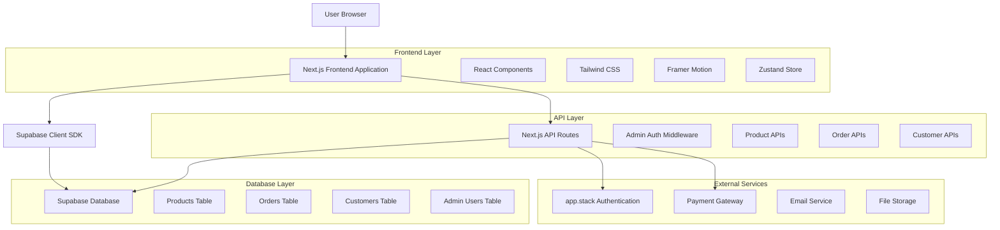
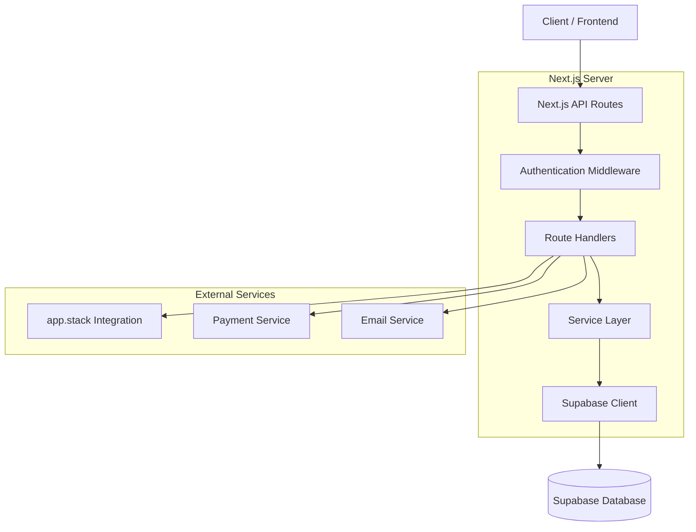
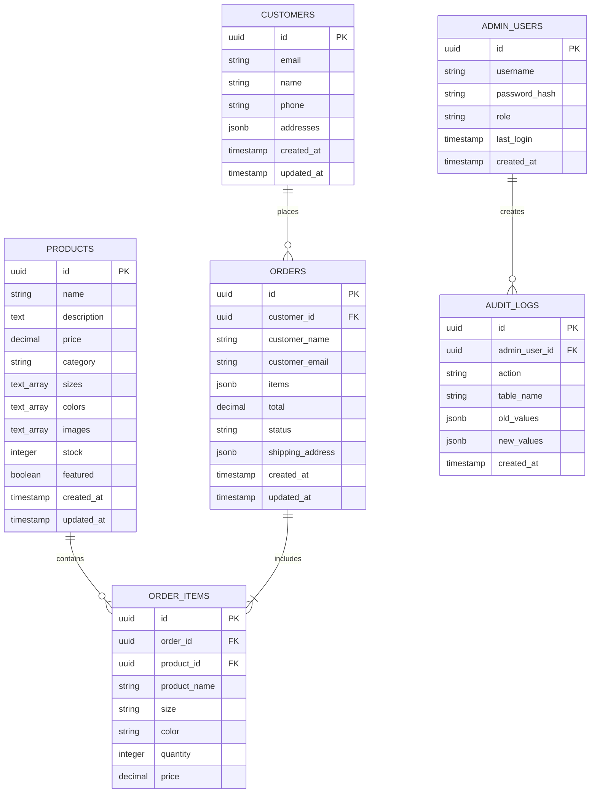

# Espada E-commerce Platform - Technical Architecture Document

## 1. Architecture Design



## 2. Technology Description

- **Frontend:** Next.js 15 + React 18 + TypeScript + Tailwind CSS + Framer Motion + Zustand
- **Backend:** Next.js API Routes + Supabase
- **Database:** Supabase (PostgreSQL)
- **Authentication:** app.stack (Customer) + Custom JWT (Admin)
- **Styling:** Tailwind CSS + Custom Design System
- **State Management:** Zustand + React Context
- **Animations:** Framer Motion
- **Icons:** Lucide React
- **File Storage:** Supabase Storage
- **Email:** Supabase Auth + Custom Email Service

## 3. Route Definitions

| Route | Purpose |
|-------|---------|
| `/` | Homepage with hero section and featured collections |
| `/products` | Product catalog with filtering and search |
| `/products/[id]` | Individual product detail pages |
| `/cart` | Shopping cart management |
| `/checkout` | Multi-step checkout process |
| `/auth/login` | Customer login page |
| `/auth/register` | Customer registration page |
| `/auth/forgot-password` | Password reset page |
| `/account` | Customer account dashboard |
| `/account/orders` | Customer order history |
| `/account/profile` | Customer profile management |
| `/admin/login` | Admin authentication page |
| `/admin` | Admin dashboard overview |
| `/admin/products` | Product management interface |
| `/admin/products/[id]/edit` | Product editing interface |
| `/admin/orders` | Order management interface |
| `/admin/orders/[id]` | Order detail view |
| `/admin/customers` | Customer management interface |
| `/admin/analytics` | Business analytics dashboard |
| `/admin/reports` | Reports and data export |
| `/admin/settings` | Admin settings and configuration |

## 4. API Definitions

### 4.1 Product APIs

**Get Products**
```
GET /api/products
```

Query Parameters:
| Param Name | Param Type | isRequired | Description |
|------------|------------|------------|-------------|
| page | number | false | Page number for pagination (default: 1) |
| limit | number | false | Items per page (default: 20) |
| category | string | false | Filter by product category |
| search | string | false | Search term for product name/description |
| minPrice | number | false | Minimum price filter |
| maxPrice | number | false | Maximum price filter |
| featured | boolean | false | Filter featured products only |

Response:
| Param Name | Param Type | Description |
|------------|------------|-------------|
| products | Product[] | Array of product objects |
| pagination | PaginationInfo | Pagination metadata |
| filters | FilterOptions | Available filter options |

**Create Product (Admin)**
```
POST /api/admin/products
```

Request Headers:
| Header Name | Header Type | isRequired | Description |
|-------------|-------------|------------|-------------|
| Authorization | string | true | Bearer token for admin authentication |

Request Body:
| Param Name | Param Type | isRequired | Description |
|------------|------------|------------|-------------|
| name | string | true | Product name |
| description | string | true | Product description |
| price | number | true | Product price |
| category | string | true | Product category |
| sizes | string[] | false | Available sizes |
| colors | string[] | false | Available colors |
| images | string[] | true | Product image URLs |
| stock | number | true | Stock quantity |
| featured | boolean | false | Featured product flag |

### 4.2 Order APIs

**Create Order**
```
POST /api/orders
```

Request Body:
| Param Name | Param Type | isRequired | Description |
|------------|------------|------------|-------------|
| customerInfo | CustomerInfo | true | Customer contact information |
| items | CartItem[] | true | Array of ordered items |
| shippingAddress | Address | true | Shipping address details |
| paymentMethod | string | true | Payment method identifier |
| total | number | true | Order total amount |

Response:
| Param Name | Param Type | Description |
|------------|------------|-------------|
| orderId | string | Generated order ID |
| status | string | Order status |
| estimatedDelivery | string | Estimated delivery date |

**Get Orders (Admin)**
```
GET /api/admin/orders
```

Request Headers:
| Header Name | Header Type | isRequired | Description |
|-------------|-------------|------------|-------------|
| Authorization | string | true | Bearer token for admin authentication |

Query Parameters:
| Param Name | Param Type | isRequired | Description |
|------------|------------|------------|-------------|
| page | number | false | Page number for pagination |
| status | string | false | Filter by order status |
| search | string | false | Search by customer name/email |

### 4.3 Authentication APIs

**Customer Login (app.stack)**
```
POST /api/auth/login
```

Request Body:
| Param Name | Param Type | isRequired | Description |
|------------|------------|------------|-------------|
| email | string | true | Customer email address |
| password | string | true | Customer password |

Response:
| Param Name | Param Type | Description |
|------------|------------|-------------|
| user | User | User profile information |
| token | string | JWT access token |
| refreshToken | string | Refresh token for token renewal |

**Admin Authentication**
```
POST /api/admin/auth
```

Request Body:
| Param Name | Param Type | isRequired | Description |
|------------|------------|------------|-------------|
| username | string | true | Admin username |
| password | string | true | Admin password |

Response:
| Param Name | Param Type | Description |
|------------|------------|-------------|
| sessionToken | string | Admin session token |
| expiresAt | string | Token expiration timestamp |

Example Request:
```json
{
  "email": "customer@example.com",
  "password": "securepassword123"
}
```

Example Response:
```json
{
  "user": {
    "id": "uuid-here",
    "email": "customer@example.com",
    "name": "John Doe"
  },
  "token": "jwt-token-here",
  "refreshToken": "refresh-token-here"
}
```

## 5. Server Architecture Diagram



## 6. Data Model

### 6.1 Data Model Definition



### 6.2 Data Definition Language

**Products Table**
```sql
-- Create products table
CREATE TABLE products (
    id UUID PRIMARY KEY DEFAULT gen_random_uuid(),
    name VARCHAR(255) NOT NULL,
    description TEXT,
    price DECIMAL(10,2) NOT NULL CHECK (price >= 0),
    category VARCHAR(100) NOT NULL,
    sizes TEXT[] DEFAULT '{}',
    colors TEXT[] DEFAULT '{}',
    images TEXT[] NOT NULL DEFAULT '{}',
    stock INTEGER DEFAULT 0 CHECK (stock >= 0),
    featured BOOLEAN DEFAULT false,
    created_at TIMESTAMP WITH TIME ZONE DEFAULT NOW(),
    updated_at TIMESTAMP WITH TIME ZONE DEFAULT NOW()
);

-- Create indexes
CREATE INDEX idx_products_category ON products(category);
CREATE INDEX idx_products_featured ON products(featured) WHERE featured = true;
CREATE INDEX idx_products_price ON products(price);
CREATE INDEX idx_products_stock ON products(stock);

-- Enable RLS
ALTER TABLE products ENABLE ROW LEVEL SECURITY;

-- RLS Policies
CREATE POLICY "Products are viewable by everyone" ON products
    FOR SELECT USING (true);

CREATE POLICY "Products are manageable by authenticated admins" ON products
    FOR ALL USING (auth.role() = 'authenticated');
```

**Orders Table**
```sql
-- Create orders table
CREATE TABLE orders (
    id UUID PRIMARY KEY DEFAULT gen_random_uuid(),
    customer_id UUID REFERENCES customers(id),
    customer_name VARCHAR(255) NOT NULL,
    customer_email VARCHAR(255) NOT NULL,
    items JSONB NOT NULL,
    total DECIMAL(10,2) NOT NULL CHECK (total >= 0),
    status VARCHAR(50) DEFAULT 'pending' CHECK (status IN ('pending', 'confirmed', 'processing', 'shipped', 'delivered', 'cancelled')),
    shipping_address JSONB NOT NULL,
    tracking_number VARCHAR(100),
    created_at TIMESTAMP WITH TIME ZONE DEFAULT NOW(),
    updated_at TIMESTAMP WITH TIME ZONE DEFAULT NOW()
);

-- Create indexes
CREATE INDEX idx_orders_customer_id ON orders(customer_id);
CREATE INDEX idx_orders_status ON orders(status);
CREATE INDEX idx_orders_created_at ON orders(created_at DESC);
CREATE INDEX idx_orders_customer_email ON orders(customer_email);

-- Enable RLS
ALTER TABLE orders ENABLE ROW LEVEL SECURITY;

-- RLS Policies
CREATE POLICY "Orders are viewable by their owners" ON orders
    FOR SELECT USING (customer_id = auth.uid());

CREATE POLICY "Orders are manageable by authenticated admins" ON orders
    FOR ALL USING (auth.role() = 'authenticated');
```

**Customers Table**
```sql
-- Create customers table
CREATE TABLE customers (
    id UUID PRIMARY KEY DEFAULT gen_random_uuid(),
    email VARCHAR(255) UNIQUE NOT NULL,
    name VARCHAR(255),
    phone VARCHAR(50),
    addresses JSONB DEFAULT '[]',
    preferences JSONB DEFAULT '{}',
    created_at TIMESTAMP WITH TIME ZONE DEFAULT NOW(),
    updated_at TIMESTAMP WITH TIME ZONE DEFAULT NOW()
);

-- Create indexes
CREATE INDEX idx_customers_email ON customers(email);
CREATE INDEX idx_customers_created_at ON customers(created_at DESC);

-- Enable RLS
ALTER TABLE customers ENABLE ROW LEVEL SECURITY;

-- RLS Policies
CREATE POLICY "Customers can view their own data" ON customers
    FOR SELECT USING (id = auth.uid());

CREATE POLICY "Customers can update their own data" ON customers
    FOR UPDATE USING (id = auth.uid());

CREATE POLICY "Customers are manageable by authenticated admins" ON customers
    FOR ALL USING (auth.role() = 'authenticated');
```

**Admin Users Table**
```sql
-- Create admin_users table
CREATE TABLE admin_users (
    id UUID PRIMARY KEY DEFAULT gen_random_uuid(),
    username VARCHAR(100) UNIQUE NOT NULL,
    password_hash VARCHAR(255) NOT NULL,
    role VARCHAR(50) DEFAULT 'admin' CHECK (role IN ('admin', 'super_admin')),
    permissions JSONB DEFAULT '{}',
    last_login TIMESTAMP WITH TIME ZONE,
    is_active BOOLEAN DEFAULT true,
    created_at TIMESTAMP WITH TIME ZONE DEFAULT NOW(),
    updated_at TIMESTAMP WITH TIME ZONE DEFAULT NOW()
);

-- Create indexes
CREATE INDEX idx_admin_users_username ON admin_users(username);
CREATE INDEX idx_admin_users_role ON admin_users(role);

-- Enable RLS
ALTER TABLE admin_users ENABLE ROW LEVEL SECURITY;

-- RLS Policies
CREATE POLICY "Admin users are manageable by super admins only" ON admin_users
    FOR ALL USING (auth.role() = 'authenticated' AND auth.jwt() ->> 'role' = 'super_admin');
```

**Initial Data**
```sql
-- Insert sample products
INSERT INTO products (name, description, price, category, sizes, colors, images, stock, featured) VALUES
('Minimalist Tee', 'Premium cotton t-shirt with clean lines', 45.00, 'Sudo', ARRAY['XS', 'S', 'M', 'L', 'XL'], ARRAY['Black', 'White', 'Gray'], ARRAY['/images/tee-1.jpg'], 100, true),
('Essential Hoodie', 'Heavyweight cotton hoodie for everyday wear', 85.00, 'XVII', ARRAY['S', 'M', 'L', 'XL', 'XXL'], ARRAY['Black', 'Charcoal'], ARRAY['/images/hoodie-1.jpg'], 50, true),
('Classic Denim', 'Timeless denim with modern fit', 120.00, 'Teyo', ARRAY['28', '30', '32', '34', '36'], ARRAY['Indigo', 'Black'], ARRAY['/images/denim-1.jpg'], 75, false);

-- Insert default admin user
INSERT INTO admin_users (username, password_hash, role) VALUES
('admin', '$2b$10$encrypted_password_hash_here', 'super_admin');

-- Create updated_at trigger function
CREATE OR REPLACE FUNCTION update_updated_at_column()
RETURNS TRIGGER AS $$
BEGIN
    NEW.updated_at = NOW();
    RETURN NEW;
END;
$$ language 'plpgsql';

-- Apply updated_at triggers
CREATE TRIGGER update_products_updated_at BEFORE UPDATE ON products
    FOR EACH ROW EXECUTE FUNCTION update_updated_at_column();

CREATE TRIGGER update_orders_updated_at BEFORE UPDATE ON orders
    FOR EACH ROW EXECUTE FUNCTION update_updated_at_column();

CREATE TRIGGER update_customers_updated_at BEFORE UPDATE ON customers
    FOR EACH ROW EXECUTE FUNCTION update_updated_at_column();

CREATE TRIGGER update_admin_users_updated_at BEFORE UPDATE ON admin_users
    FOR EACH ROW EXECUTE FUNCTION update_updated_at_column();
```