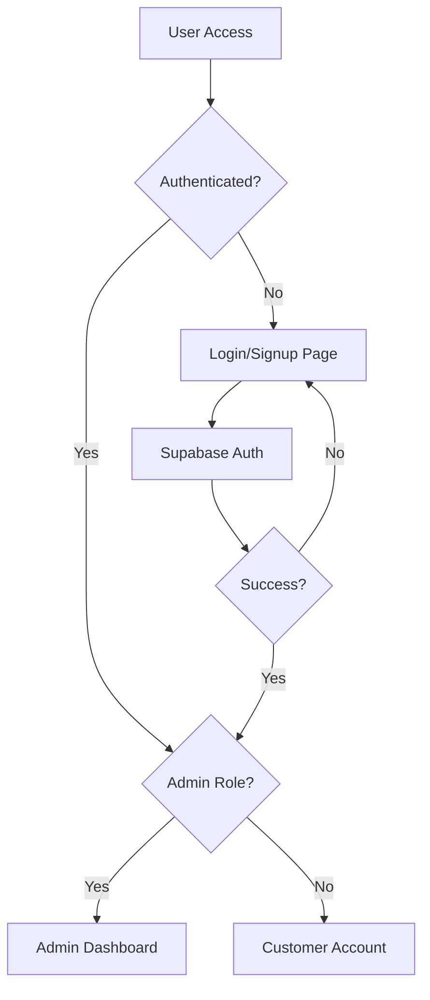

# Supabase Auth Migration Plan

## 1. Product Overview

This document outlines the complete migration from Stack Auth to Supabase Auth for the Espada e-commerce platform. The migration will establish a reliable authentication system with proper admin role management, ensuring daniel.nonso48@gmail.com can access the admin dashboard while regular users access customer accounts.

The migration addresses current authentication issues including improper role-based redirections and conflicting authentication contexts by implementing a clean, unified Supabase-based authentication system.

## 2. Core Features

### 2.1 User Roles

| Role | Registration Method | Core Permissions |
|------|---------------------|------------------|
| Admin User | Pre-configured email (daniel.nonso48@gmail.com) | Full admin dashboard access, user management, product management |
| Customer User | Email/password registration | Customer account access, order management, profile settings |

### 2.2 Feature Module

Our authentication system migration consists of the following main components:
1. **Authentication Pages**: Login, signup, password reset pages using Supabase Auth
2. **Admin Dashboard**: Protected admin interface with role verification
3. **Customer Account**: Customer profile and order management interface
4. **Authentication Context**: Unified auth state management across the application

### 2.3 Page Details

| Page Name | Module Name | Feature description |
|-----------|-------------|---------------------|
| Login Page | Supabase Auth Form | Email/password login with Supabase Auth, automatic role-based redirection |
| Signup Page | Registration Form | New user registration with email verification, automatic customer profile creation |
| Admin Dashboard | Role Protection | Admin-only access with server-side role verification, redirect non-admins |
| Customer Account | Profile Management | Customer profile editing, order history, account settings |
| Password Reset | Auth Recovery | Password reset flow using Supabase Auth recovery |

## 3. Core Process

### Admin Authentication Flow
1. Admin visits login page
2. Enters credentials (daniel.nonso48@gmail.com)
3. Supabase Auth validates credentials
4. System checks admin role in database
5. Redirects to admin dashboard if verified
6. Shows access denied if not admin

### Customer Authentication Flow
1. Customer visits login/signup page
2. Completes authentication with Supabase
3. System creates/updates customer profile
4. Redirects to customer account page
5. Access to customer-specific features

## 4. User Interface Design

### 4.1 Design Style
- **Primary Colors**: Dark theme (#1a1a1a background, #ffffff text)
- **Secondary Colors**: Accent colors for buttons and highlights
- **Button Style**: Modern rounded buttons with hover effects
- **Font**: Gilroy font family, 16px base size
- **Layout Style**: Clean, minimalist design with card-based components
- **Icons**: Modern, consistent icon set for authentication actions

### 4.2 Page Design Overview

| Page Name | Module Name | UI Elements |
|-----------|-------------|-------------|
| Login Page | Auth Form | Centered form card, email/password inputs, login button, signup link |
| Signup Page | Registration Form | Form card with email/password/confirm fields, terms checkbox, signup button |
| Admin Dashboard | Navigation Layout | Top navigation bar, sidebar menu, main content area with admin tools |
| Customer Account | Profile Layout | User info card, navigation tabs, order history table, settings panel |

### 4.3 Responsiveness
The authentication system is mobile-first responsive, with touch-optimized form inputs and navigation elements that adapt to different screen sizes.