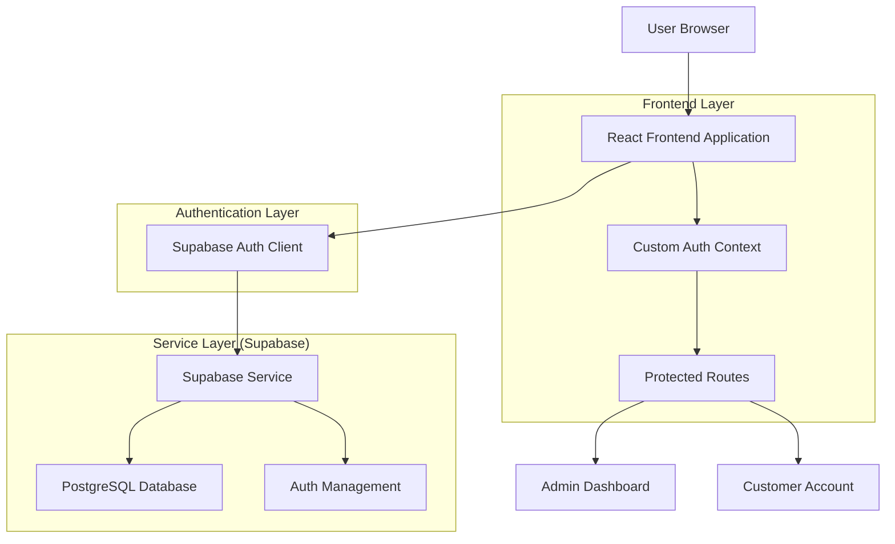
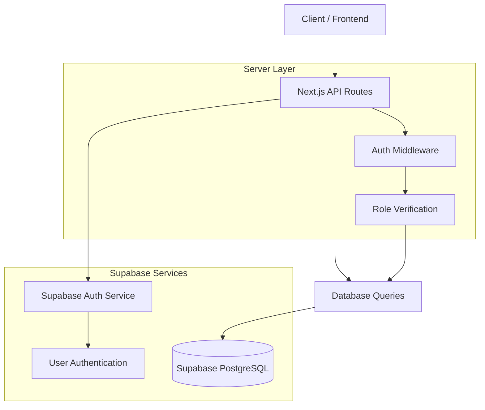
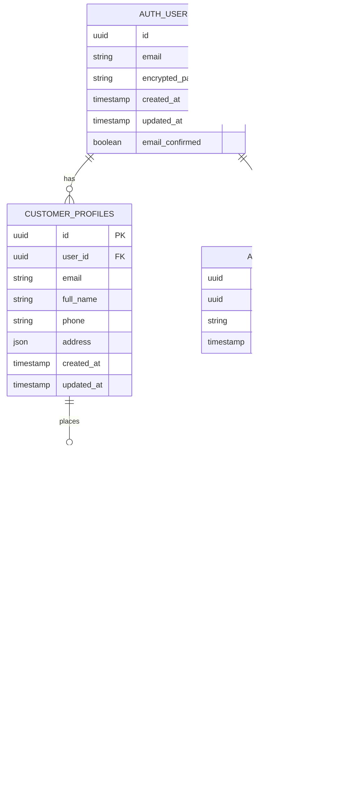

# Supabase Auth Technical Architecture

## 1. Architecture Design



## 2. Technology Description

- Frontend: React@18 + TypeScript + Tailwind CSS + Next.js@14
- Authentication: Supabase Auth + Custom Auth Context
- Database: Supabase (PostgreSQL)
- State Management: React Context + Custom Hooks

## 3. Route Definitions

| Route | Purpose |
|-------|---------|
| /login | Supabase Auth login page with role-based redirection |
| /signup | User registration with automatic customer profile creation |
| /admin | Protected admin dashboard (admin users only) |
| /admin/login | Admin-specific login page with enhanced security |
| /account | Customer account page with profile management |
| /auth/callback | Supabase Auth callback handler for email verification |
| /auth/reset-password | Password reset flow using Supabase Auth |

## 4. API Definitions

### 4.1 Core API

Authentication and user management endpoints

```
POST /api/auth/callback
```
Handles Supabase Auth callbacks for email verification and password resets

Request: Supabase Auth callback data
Response: Redirect to appropriate page based on user role

```
GET /api/auth/user
```
Gets current authenticated user information

Response:
| Param Name | Param Type | Description |
|------------|------------|-------------|
| user | object | Supabase user object |
| profile | object | User profile data |
| isAdmin | boolean | Admin role status |

```
POST /api/auth/admin-check
```
Verifies admin role for protected routes

Request:
| Param Name | Param Type | isRequired | Description |
|------------|------------|------------|-------------|
| userId | string | true | Supabase user ID |

Response:
| Param Name | Param Type | Description |
|------------|------------|-------------|
| isAdmin | boolean | Admin verification result |
| redirectTo | string | Redirect URL based on role |

## 5. Server Architecture Diagram



## 6. Data Model

### 6.1 Data Model Definition



### 6.2 Data Definition Language

Authentication Users (Managed by Supabase Auth)
```sql
-- Supabase Auth automatically manages auth.users table
-- We only need to create our custom tables

-- Admins table for role management
CREATE TABLE admins (
    id UUID PRIMARY KEY DEFAULT gen_random_uuid(),
    user_id UUID REFERENCES auth.users(id) ON DELETE CASCADE,
    email VARCHAR(255) UNIQUE NOT NULL,
    created_at TIMESTAMP WITH TIME ZONE DEFAULT NOW()
);

-- Customer profiles table
CREATE TABLE customer_profiles (
    id UUID PRIMARY KEY DEFAULT gen_random_uuid(),
    user_id UUID REFERENCES auth.users(id) ON DELETE CASCADE,
    email VARCHAR(255) UNIQUE NOT NULL,
    full_name VARCHAR(255),
    phone VARCHAR(20),
    address JSONB,
    created_at TIMESTAMP WITH TIME ZONE DEFAULT NOW(),
    updated_at TIMESTAMP WITH TIME ZONE DEFAULT NOW()
);

-- Products table
CREATE TABLE products (
    id UUID PRIMARY KEY DEFAULT gen_random_uuid(),
    name VARCHAR(255) NOT NULL,
    description TEXT,
    price DECIMAL(10,2) NOT NULL,
    stock_quantity INTEGER DEFAULT 0,
    active BOOLEAN DEFAULT true,
    created_at TIMESTAMP WITH TIME ZONE DEFAULT NOW(),
    updated_at TIMESTAMP WITH TIME ZONE DEFAULT NOW()
);

-- Orders table
CREATE TABLE orders (
    id UUID PRIMARY KEY DEFAULT gen_random_uuid(),
    customer_id UUID REFERENCES customer_profiles(id) ON DELETE CASCADE,
    total_amount DECIMAL(10,2) NOT NULL,
    status VARCHAR(50) DEFAULT 'pending',
    created_at TIMESTAMP WITH TIME ZONE DEFAULT NOW(),
    updated_at TIMESTAMP WITH TIME ZONE DEFAULT NOW()
);

-- Order items table
CREATE TABLE order_items (
    id UUID PRIMARY KEY DEFAULT gen_random_uuid(),
    order_id UUID REFERENCES orders(id) ON DELETE CASCADE,
    product_id UUID REFERENCES products(id) ON DELETE CASCADE,
    quantity INTEGER NOT NULL,
    unit_price DECIMAL(10,2) NOT NULL
);

-- Indexes for performance
CREATE INDEX idx_customer_profiles_user_id ON customer_profiles(user_id);
CREATE INDEX idx_customer_profiles_email ON customer_profiles(email);
CREATE INDEX idx_admins_user_id ON admins(user_id);
CREATE INDEX idx_admins_email ON admins(email);
CREATE INDEX idx_orders_customer_id ON orders(customer_id);
CREATE INDEX idx_order_items_order_id ON order_items(order_id);

-- Row Level Security (RLS) policies
ALTER TABLE customer_profiles ENABLE ROW LEVEL SECURITY;
ALTER TABLE orders ENABLE ROW LEVEL SECURITY;
ALTER TABLE order_items ENABLE ROW LEVEL SECURITY;

-- Policies for customer_profiles
CREATE POLICY "Users can view own profile" ON customer_profiles
    FOR SELECT USING (auth.uid() = user_id);

CREATE POLICY "Users can update own profile" ON customer_profiles
    FOR UPDATE USING (auth.uid() = user_id);

CREATE POLICY "Users can insert own profile" ON customer_profiles
    FOR INSERT WITH CHECK (auth.uid() = user_id);

-- Policies for orders
CREATE POLICY "Users can view own orders" ON orders
    FOR SELECT USING (
        customer_id IN (
            SELECT id FROM customer_profiles WHERE user_id = auth.uid()
        )
    );

-- Admin access policies
CREATE POLICY "Admins can view all profiles" ON customer_profiles
    FOR ALL USING (
        EXISTS (
            SELECT 1 FROM admins WHERE user_id = auth.uid()
        )
    );

-- Initial admin user
INSERT INTO admins (user_id, email) 
SELECT id, email FROM auth.users 
WHERE email = 'daniel.nonso48@gmail.com'
ON CONFLICT (email) DO NOTHING;
```

### 6.3 Authentication Context Structure

```typescript
interface AuthContextType {
  user: User | null;
  profile: CustomerProfile | null;
  isAdmin: boolean;
  loading: boolean;
  signIn: (email: string, password: string) => Promise<void>;
  signUp: (email: string, password: string, userData: any) => Promise<void>;
  signOut: () => Promise<void>;
  updateProfile: (data: Partial<CustomerProfile>) => Promise<void>;
}

interface User {
  id: string;
  email: string;
  email_confirmed_at?: string;
  created_at: string;
}

interface CustomerProfile {
  id: string;
  user_id: string;
  email: string;
  full_name?: string;
  phone?: string;
  address?: any;
  created_at: string;
  updated_at: string;
}
```